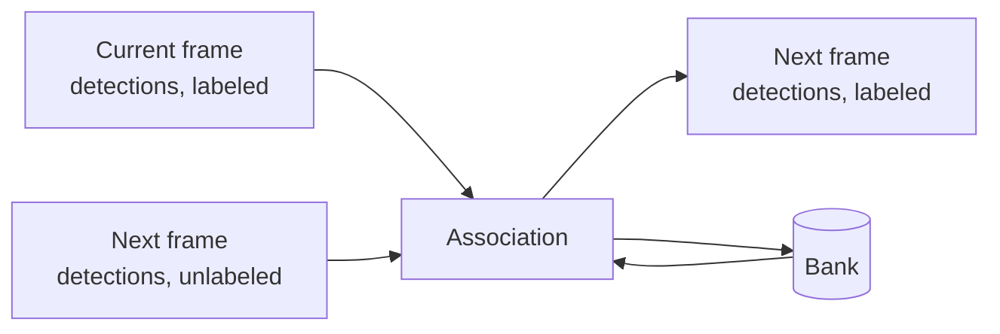

# Spatial-Aware Multi-Person Re-Identification

<!-- Lead with the current output: a sample, then the demo. Write once the project is done. -->

This project builds on a presentation my groupmates, Mark Gallardo and Caine Bautista, and I delivered at the 8th Collaborative Online International Learning (COIL) Conference. Our approach at the time scored each pair of people (one from the current frame, one from the next) in isolation. When following one person, the best-scoring match decided which person in the next frame, if any, was the tracked one; when tracking everyone, the scores went through Hungarian matching[^kuhn]. Attention mixed three inputs per pair: a learnable summary token, the difference between the two people's appearance embeddings, and their element-wise product. The summary token's output was combined with spatial and temporal features (position offsets, overlap, scale, time gap) to produce a match score.

I wanted to improve this by matching everyone at once. Instead of scoring pairs in isolation, the model looks at every person in the current frame and every detection in the new frame together, so one match can inform another, with the spatial features from the previous project guiding it.

Trackers also tend to lose people who stay hidden for more than a moment. In MOT17 alone, 47 of 587 occlusions last longer than two seconds[^stats], well past ByteTrack's default wait of one second[^bytetrack]. When a person loses their detection, whether behind an obstacle or off-screen, they go into a bank that remembers their appearance and last known state. The bank also decides how long each entry is kept before the person is considered gone.

The same bank lets the tracker re-identify people who leave the frame and come back. MOT17 gives returning people new IDs[^mot16], so this can't be scored on it directly. Instead, it is tested by simulating exits.

My approach follows this structure:



## Phase 0: Preparing the dataset

This project uses [MOT17](https://motchallenge.net/data/MOT17/)[^mot16]. Before anything else, the data was cleaned:

- **Triplicate sequences.** MOT17 ships every sequence three times, once per public detector (DPM, FRCNN, SDP), with identical images and ground truth. All 14 sequences were verified identical by content hash and collapsed into one copy, with the three detection files side by side. This saves 3.9 GB and rules out a subtle leak: splitting train and validation by detector folder would put the same video on both sides.
- **Unsorted detections.** Some detection files are out of frame order (246 rows in MOT17-02's FRCNN file), so every file is sorted on load.
- **Mixed formats.** DPM detections have ten columns and unbounded scores (−0.5 to 4.77); FRCNN and SDP have seven columns and scores in [0, 1]. They are parsed into one format, and score thresholds are set per detector.
- **Coordinates.** MOT boxes are 1-based `left, top, width, height`. They are converted to 0-based corners internally and back when writing results.
- **Boxes past the frame.** 14.6% of pedestrian boxes extend beyond the image border[^stats], so boxes are clipped before cropping.
- **What gets scored.** Only pedestrians marked for evaluation are used as targets. Static people, people on vehicles and reflections are ignored, following the benchmark's rules[^mot16].
- **Hidden people.** People stay annotated while fully occluded, so their crops show whoever is in front. 18.9% of training crops have visibility below 0.2[^stats], and these are left out when training the appearance model.
- **Split.** Each training sequence is cut in time: the first half for training, the second for validation. This follows CenterTrack's convention[^centertrack], so results stay comparable with published work.

As a check, the cleaned ground truth, scored as if it were tracker output, gets a perfect 100 in HOTA[^hota], MOTA[^clear] and IDF1[^idf1] on every split.

## Usage

Requires [uv](https://docs.astral.sh/uv/). On Windows and Linux, `uv sync` installs PyTorch built for CUDA 13.0.

```bash
uv sync
```

### Data

Extract the MOT17 release so that `MOT17/train` and `MOT17/test` sit at the repository root, then:

```bash
uv run python -m reidtrack.data.prepare --raw MOT17 --out data/mot17
uv run python -m reidtrack.data.stats --root data/mot17
```

`prepare` verifies and deduplicates the release into `data/mot17` and exports the splits for evaluation. It writes nothing if the copies differ. Afterwards `MOT17/` can be deleted. `stats` prints the per-sequence figures quoted above. MOT17 is not part of this repository and remains under its own terms.

### Baselines

```bash
uv run python -m reidtrack.baselines sort --min-score 0.5
uv run python -m reidtrack.baselines bytetrack
```

Reimplementations of SORT[^sort] and ByteTrack[^bytetrack], run on the public detections. Results and scores go to `runs/<name>/`.

### Evaluation

```bash
uv run python -m reidtrack.eval --results runs/<tracker> --split val_half
uv run python -m reidtrack.eval --oracle
```

Result files are one `<sequence>.txt` per sequence in MOT format, using the sequence's own frame numbers; rows outside the split are ignored. Scoring uses TrackEval[^hota]. `--oracle` scores the ground truth itself and must report 100.

### Visualisation

```bash
uv run python -m reidtrack.viz MOT17-02 --gt --split val_half --scale 0.5
uv run python -m reidtrack.viz MOT17-02 --results runs/<tracker>/MOT17-02.txt --frame 340
```

Writes an MP4, or a PNG for a single `--frame`, to `runs/viz/`. People who are annotated but hidden are drawn dashed.

### Latency

```bash
uv run python -m reidtrack.eval.latency --seq MOT17-04
```

Benchmarks reading and decoding frames. `StageTimer` in `reidtrack.eval.latency` times the stages of a pipeline.

### Tests

```bash
uv run pytest
```

## License

Apache-2.0; see [LICENSE](LICENSE).

[^kuhn]: H. W. Kuhn. The Hungarian method for the assignment problem. *Naval Research Logistics Quarterly*, 2(1–2):83–97, 1955.
[^stats]: Measured on the MOT17 training set with `python -m reidtrack.data.stats`. An occlusion here is a stretch in which a person's visibility drops below 0.1 and later recovers.
[^bytetrack]: Y. Zhang et al. ByteTrack: Multi-Object Tracking by Associating Every Detection Box. *ECCV*, 2022. [arXiv:2110.06864](https://arxiv.org/abs/2110.06864). The reference implementation keeps a lost track for 30 frames (`track_buffer`), scaled to the frame rate.
[^mot16]: A. Milan, L. Leal-Taixé, I. Reid, S. Roth, K. Schindler. MOT16: A Benchmark for Multi-Object Tracking. [arXiv:1603.00831](https://arxiv.org/abs/1603.00831), 2016. Annotation rules in §2; evaluation classes in §4.
[^centertrack]: X. Zhou, V. Koltun, P. Krähenbühl. Tracking Objects as Points. *ECCV*, 2020. [arXiv:2004.01177](https://arxiv.org/abs/2004.01177).
[^hota]: J. Luiten et al. HOTA: A Higher Order Metric for Evaluating Multi-Object Tracking. *IJCV*, 2021. [arXiv:2009.07736](https://arxiv.org/abs/2009.07736). Computed with [TrackEval](https://github.com/JonathonLuiten/TrackEval).
[^clear]: K. Bernardin, R. Stiefelhagen. Evaluating Multiple Object Tracking Performance: The CLEAR MOT Metrics. *EURASIP Journal on Image and Video Processing*, 2008.
[^idf1]: E. Ristani, F. Solera, R. Zou, R. Cucchiara, C. Tomasi. Performance Measures and a Data Set for Multi-Target, Multi-Camera Tracking. *ECCV Workshops*, 2016. [arXiv:1609.01775](https://arxiv.org/abs/1609.01775).
[^sort]: A. Bewley, Z. Ge, L. Ott, F. Ramos, B. Upcroft. Simple Online and Realtime Tracking. *ICIP*, 2016. [arXiv:1602.00763](https://arxiv.org/abs/1602.00763).
