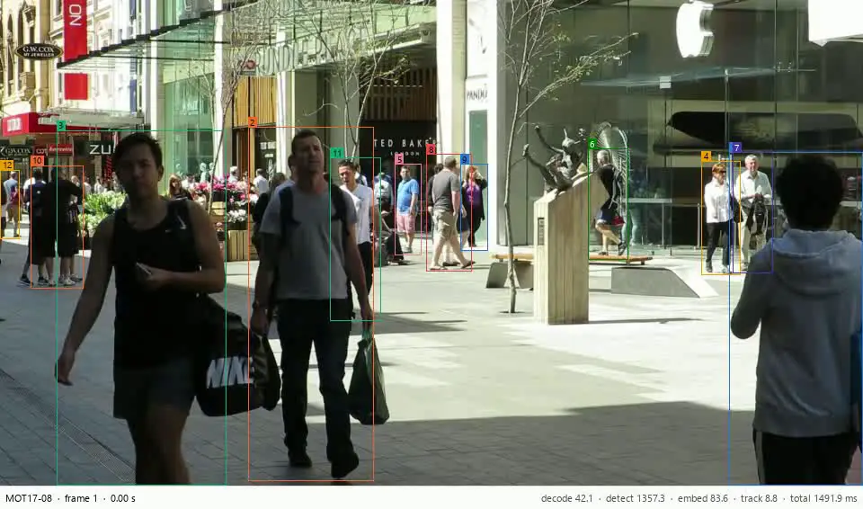
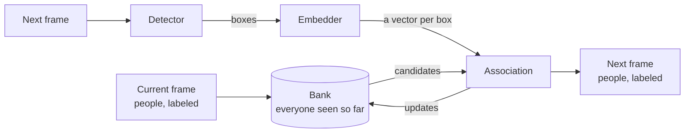
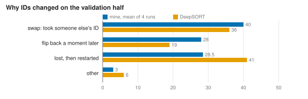
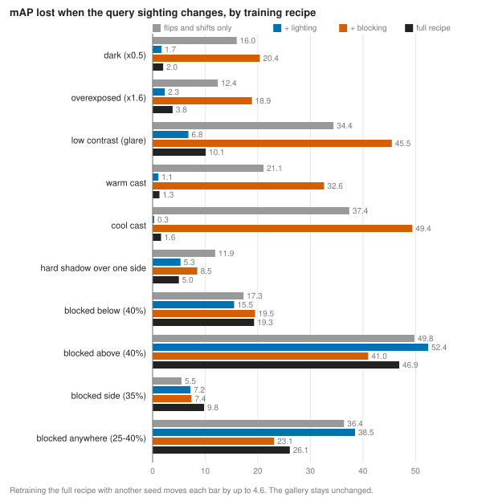

# Spatial-Aware Multi-Person Re-Identification



*Seen above: My tracker on MOT17-08, a video that none of its models trained on. Each box carries the ID the tracker gave that person, and the bottom right shows how long each stage took on that frame, in milliseconds, on a laptop RTX 4050. Footage from MOT17 [[1]](#ref-1), CC BY-NC-SA 3.0.*

This is a real-time multi-person tracker for a fixed camera, such as CCTV inside a bus. A small learned matcher decides which new detection belongs to which known person, and a memory of everyone seen so far, which I call the bank, lets the tracker recognize people after they drop out of view. I trained every learned part on one laptop graphics card (GPU): the matcher from scratch, and the appearance model and the detector by fine-tuning public weights on MOT17, the 2017 Multiple Object Tracking benchmark. The whole pipeline, from raw frames to tracks, runs at **33 frames per second (fps)** on that laptop ([Speed](#speed) lists its specs) and beats the free trackers people usually reach for, SORT [[2]](#ref-2), ByteTrack [[3]](#ref-3), and DeepSORT [[4]](#ref-4), under identical conditions.

The scores below come from MOT17's validation half. HOTA, Higher Order Tracking Accuracy [[5]](#ref-5), combines finding people with keeping their identities. AssA, Association Accuracy, measures only the second part, and IDF1 counts how many boxes carry the right ID [[6]](#ref-6). Higher is better for all three; lower is better for ID switches.

| Tracker | Detections | HOTA | AssA | IDF1 | ID switches |
|---|---|---|---|---|---|
| SORT | MOT17's public boxes | 48.4 | 56.2 | 54.5 | 222 |
| ByteTrack | public boxes | 49.4 | 57.7 | 56.2 | 198 |
| DeepSORT | public boxes | 51.9 | 63.7 | 60.6 | 102 |
| **Mine** | public boxes | **52.6** | **64.8** | **61.7** | **98.3** |
| DeepSORT | my fine-tuned detector | 51.8 | 57.3 | 63.0 | 206 |
| **Mine, whole pipeline** | my fine-tuned detector | **54.3** | **62.0** | **65.9** | **162** |

(DeepSORT gets the same appearance model as my tracker. My public-box row averages six trained matchers, and my last row comes from one, so its ID switches can move by about 10. DeepSORT's last row used the float32 detector's boxes, on which my tracker scores 53.9 HOTA; my last row is the deployed float16 pipeline.)

On the same boxes, my tracker beats DeepSORT on every score and halves ByteTrack's ID switches. With my detector, the lead over DeepSORT grows to 2.5 HOTA and 21% fewer ID switches.

## Introduction

This project builds on a presentation my groupmates, Mark Gallardo and Caine Bautista, and I gave at the 8th Collaborative Online International Learning (COIL) Conference. That version scored each pair of people, one from the current frame and one from the next, in isolation, and ran the scores through Hungarian matching [[7]](#ref-7) when tracking everyone. I wanted to fix two things about it.

First, trackers lose people who stay hidden for more than a moment. In MOT17's training videos, 47 of the 587 occlusions last longer than two seconds, twice ByteTrack's default wait of one second. So when a person loses their detection, my tracker keeps them in the bank, with their appearance and last known position, and decides how long to wait before calling them gone.

Second, the setting. A camera inside a bus doesn't move relative to the cabin, but the light swings from window glare to tunnels, passengers block each other constantly, and an edge device has a tight budget per frame. I also wanted the code to stay Apache-2.0, which rules out Ultralytics YOLO and its GNU Affero General Public License (AGPL), and everything had to train on a laptop RTX 4050 with 6 GB of memory.

The work taught me more than the results table shows:

- A better appearance model made tracking worse until I recalibrated the distance cutoff that decides "same person".
- An appearance model that trained on the same people as the matcher leaks into it. Cross-fitting fixed that.
- The overlap with where each person was last matched, did more for ID switches than attention or any other idea I tried.
- Evidence about competing candidates hurt, and evidence about the pair itself helped.
- A single trained matcher swings by 10 to 20 ID switches from run to run, so small effects need many runs before they mean anything.

## Method



*Seen above: A diagram of the tracker's pipeline, frame by frame.*

- The detector, RF-DETR small fine-tuned on MOT17, puts a box around every person in the next frame.
- The embedder, OSNet x0.5, turns each confident box into a vector of 512 numbers that describes how that person looks.
- The bank holds everyone seen so far: where they're heading, how they look, where the tracker last matched them, and whether they're in view, hidden, or gone.
- Association scores every pair of known person and new box with the learned matcher, then assigns everyone at once. A confident box that matches no one starts a new person.
- Association writes the clean sightings back to the bank, so the next frame starts from this frame's labeled people.

### Data and evaluation

MOT17 ships every video three times, once per public detector, with out-of-order detection files and boxes that run past the image border. I deduplicated and cleaned it, then split each training video in time, first half for training and second half for validation, following CenterTrack [[8]](#ref-8). Every number here comes from the validation half. Before trusting the scorer, TrackEval [[5]](#ref-5), I checked that it gives the ground truth a perfect 100 and raw detections with no tracking only 5.0 HOTA.

I reimplemented SORT, ByteTrack, and DeepSORT from their papers, so they share one data loader and one scorer with my tracker. I tuned every threshold on the training half and gave every tracker the same detections, so any difference comes from matching people across frames.

### Detector

I compared two Apache-2.0 families off the shelf, RF-DETR [[9]](#ref-9) and D-FINE [[10]](#ref-10), both trained on the everyday photos of COCO, Common Objects in Context [[11]](#ref-11), on the validation halves of MOT17-04 and MOT17-09. I chose RF-DETR small for speed: 43.8 DetA, the detection half of HOTA, at 28.5 ms per frame, 1.2 points behind the most accurate D-FINE and 1.7× faster. MOT17's public boxes, from Faster R-CNN [[12]](#ref-12), score 46.2.

This is how we fine-tuned it. I converted the training half into a COCO-format person dataset, trained on the first three quarters of each video, and let the last quarter decide when to stop: after three epochs without improvement, at most 30. It stopped on its own after 52 minutes, and DetA on the same two videos rose from 43.8 to **57.8**, 11.6 above the public boxes. It learned on the first half of the same videos, so it knows these cameras. On new footage the gain will be smaller.

### Appearance model

The embedder turns each person's crop into a vector of 512 numbers, so comparing two people takes one dot product. The COIL version compared people inside a model, one run per pair, which on a crowd of 27 people is 729 runs per frame against 27. I fine-tuned the Omni-Scale Network, OSNet [[13]](#ref-13), starting from weights trained on the Multi-Scene Multi-Time person dataset, MSMT17 [[14]](#ref-14), with the *Bag of Tricks* recipe [[15]](#ref-15): an identity classifier plus a triplet loss [[16]](#ref-16). I changed two things for tracking: every batch comes from one video, so the look-alikes share lighting and background, and each person's four crops come from four stretches of their track. On validation people it never saw, OSNet x0.5 reaches **78.1** mean average precision (mAP), matching the full-width model at a quarter of the parameters and 1.8× its speed.

Two problems came with the better features. First, DeepSORT got *worse* with the full-width model's fine-tuned features, 145 ID switches against 121, because its fixed cutoff of 0.2 no longer fit the new distances. Two detections in the same frame are always different people, so I set each model's cutoff to let through the same share of same-frame pairs as before, without any labels, and ID switches fell to 98. Second, the appearance model had seen every person in the training half, where it scores 99.7 mAP. A matcher trained on those features learns that appearance is never wrong. So I cross-fit it: I split the training videos into two folds, trained one appearance model per fold, and let each embed the other fold. The matcher then trains on features at 71.6 mAP, close to what it sees on new people.

### Bank and matcher

Each person in the bank has a Kalman filter for motion, a running average of their appearance plus up to four distinct views, the last box the tracker matched them to, and a state: new, active, hidden, or gone off an edge. Each frame, the tracker retrieves candidates from the bank for every new box, scores every pair, matches everyone in one assignment, writes back only clean sightings, and forgets people after 5 seconds hidden.

The scoring is a multilayer perceptron (MLP) of about 5,700 parameters. It sees 22 cues per pair: appearance similarity, position against the motion prediction, overlap with the last matched box, time since last seen, and state. It outputs the probability that the pair is the same person. The Hungarian method matches everyone at once, and any pair below 0.5 becomes a new person. I trained it on 950,127 pairs recorded from the tracker itself on the training half, so it learns from the situations the tracker actually gets into, including its own mistakes [[17]](#ref-17).



Sorting every ID switch by what happened showed where the bank helps and where it doesn't. My tracker restarts people as new IDs 30% less often than DeepSORT, 28.5 against 41, which is the bank working. It lost on swaps and flip-backs between two people standing close together. Every position cue compared against the motion prediction, which drifts, so I added one cue for the overlap with where the person actually was. It cut ID switches from 107 to 98.3. Of the restarts that remain, 73% happen while the bank still holds the person, after a median gap of 0.73 s: the tracker remembered them and failed to recognize them.

### What didn't work

| Tried | Result on the validation half |
|---|---|
| Attention across pairs, so each score sees its rivals | 149 to 379 ID switches over three runs |
| Retraining on pairs recorded while the learned matcher drives | no gain after the three rounds I fixed in advance |
| Cues for how clearly a pair beats its best rival | 112 ID switches, against 98.3 without |
| Camera motion compensation, as in BoT-SORT [[18]](#ref-18) | 98.5 ID switches with it, 98.3 without, at 24 ms per frame |
| Averaging five trained matchers | 103 and 96 ID switches, no steadier |
| Requiring a switch to win by a margin | 100.5 and 104.3 ID switches, against 99.5 without |

Everything that looked at the other candidates made tracking worse. Who else sits in the bank depends on the tracker's own earlier decisions, so evidence about rivals shifts as soon as the matcher's choices differ from the ones it trained on. The attention model shows it plainly: 94.6% precision on held-out pairs against 89.7% for the simple matcher, and up to 379 ID switches inside the tracker. Most of these were detours I could have skipped by measuring run-to-run noise first, since single runs swing by more than the effects I was chasing.

### Robustness under different conditions

Changing light and people blocking each other weaken the visual cues the appearance model reads. A small device may also skip frames, which weakens the temporal cues: motion and position between sightings. I tested each kind on its own.

#### Visual cues

I changed each query crop of the unseen validation people one way at a time, lighting or blocking, and measured how much recognition drops against the clean score on the same queries. A blocked query only counts while at least 30% of the person still shows. I also retrained the appearance model with its lighting and blocking augmentations switched on and off, and once more with a second seed to measure noise, which moves each number by up to 4.6 points.



*Seen above: mAP lost under each change for each training recipe, against the clean score on the same queries.*

Lighting augmentation carries the lighting results: without it, a cool color cast costs 37 points of mAP, and with it, 2. With the full recipe, darkness and color casts cost 1.3 to 2.0 points and glare 10.1. Blocking remains the weak spot. Covering the head and shoulders drops mAP from 82.3 to 35.4. Random erasing during training helps against random patches and blocked heads, 23 and 41 points lost instead of 36 and 50, but not against blocks from below or the side.

None of these gaps show up in MOT17 tracking: DeepSORT's ID switches with every recipe stay within the 12-switch noise. My guess is that MOT17's light barely changes between two sightings of the same person.

#### Temporal cues

I fed both trackers every 2nd or every 3rd frame and told them the lower frame rate, then filled the skipped frames by interpolation to score against every annotated frame. Association barely moves: at every 3rd frame, AssA drops 1.6 points, and the lead over DeepSORT grows to 1.4 HOTA and 2.2 IDF1. Every time limit in my tracker runs in seconds and every position cue scales with the person's height, while DeepSORT counts in frames. Processing every 3rd frame of a 30 fps camera also triples the time budget per frame to about 100 ms.

#### Both

The matcher weighs both kinds of cues in one score, so that one can carry a match when the other weakens. The restarts in "Bank and matcher" show where that breaks: most happen while the bank still holds the person, after a median gap of 0.73 s. The gap is short, yet the tracker fails to recognize them. In a crowd, a gap that short is most likely someone walking past, which is the blocking the visual test flags as the weak spot. I haven't tested both at once inside the tracker, like a skipped-frame feed under drifting light: the stress test changes single crops, and frame skipping leaves every crop as it is.

### Speed

Every time and training run in this README comes from one laptop, an MSI Thin 15 B13VE:

| Part | Spec |
|---|---|
| GPU | NVIDIA GeForce RTX 4050 Laptop, 6 GB, 45 W maximum power (NVIDIA rates this GPU from 35 to 115 W) |
| CPU | Intel Core i7-13620H |
| RAM | 8 GB |
| Software | Windows 11, Python 3.13, PyTorch 2.14, CUDA 13.0 |

The pipeline handles one frame at a time, with no batching across frames.

The first run of the whole pipeline on MOT17-08 took 57.7 ms per frame. Two changes brought it to 29.0 ms without hurting accuracy. The tracker only reads the appearance of boxes scoring at least 0.6, 13.7 of the 45.5 per frame, so embedding just those cut that stage from 21.2 to 5.8 ms with identical tracks. Running the detector in float16 as a compiled graph cut detection from 28.4 to 15.4 ms, with boxes that overlap the float32 ones by 99.1%. Across all seven validation videos, the pipeline averages 30.7 ms per frame.

## Conclusion

A small, simple matcher over a memory of people beats the standard free trackers on MOT17 when everything else stays equal, and keeps up with a 30 fps camera on a laptop. The ideas that held up were the plain ones: a calibrated cutoff, leak-free training data, one cue for where each person was, and time measured in seconds. The heavier ideas, attention included, lost.

What's still open:

- ID switches beat DeepSORT on average, not on every run: single matchers land between 95 and 108 on public boxes, while DeepSORT stays at 102.
- The detector learned on the same videos it's scored on, so I haven't shown the gain on footage from other cameras.
- The appearance model met 45% of the validation people during training. DeepSORT uses the same features, so the comparison stays fair, but the absolute numbers probably look a little better than they should.
- Blocked heads and shoulders still more than halve recognition.
- The bank can bring back someone who left and returned, but MOT17 gives returning people new IDs, so I haven't tested re-entry.
- The weights learned from MOT17 and MSMT17, whose licenses allow only non-commercial use. The code is Apache-2.0, but a commercial version would need retraining on licensed data.

Next I'd test it on footage from new cameras, work on recognition through blocking, and build a proper re-entry test.

## Run it yourself

It needs [uv](https://docs.astral.sh/uv/) and an NVIDIA GPU. MOT17 and the trained weights aren't in this repository, so the first run trains everything.

```bash
uv sync --extra detect
```

Download MOT17 from [motchallenge.net](https://motchallenge.net/data/MOT17/), extract it so `MOT17/train` and `MOT17/test` sit in the repository root, and prepare it:

```bash
uv run python -m reidtrack.data.prepare --raw MOT17 --out data/mot17
```

Train the three models. The appearance model starts from the MSMT17 OSNet x0.5 weights in the torchreid model zoo [[19]](#ref-19), saved as `data/weights/osnet_x0_5_msmt17.pth`. RF-DETR downloads its own starting weights. On Windows, set `PYTHONUTF8=1` before fine-tuning the detector.

```bash
# detector
uv run python -m reidtrack.detection.coco
uv run python -m reidtrack.detection.finetune
# appearance model, plus the two cross-fitting folds
uv run python -m reidtrack.retrieval.crops --split train_half
uv run python -m reidtrack.retrieval.crops --split val_half --stride 3
uv run python -m reidtrack.retrieval.train --backbone osnet_x0_5 --init data/weights/osnet_x0_5_msmt17.pth
uv run python -m reidtrack.retrieval.train --backbone osnet_x0_5 --init data/weights/osnet_x0_5_msmt17.pth --name osnet_x0_5_foldA --sequences MOT17-04,MOT17-05,MOT17-11
uv run python -m reidtrack.retrieval.train --backbone osnet_x0_5 --init data/weights/osnet_x0_5_msmt17.pth --name osnet_x0_5_foldB --sequences MOT17-02,MOT17-09,MOT17-10,MOT17-13
uv run python -m reidtrack.retrieval.cache --weights data/weights/retriever/osnet_x0_5_foldA/last.pt --model osnet_x0_5_crossfit --sequences MOT17-02,MOT17-09,MOT17-10,MOT17-13
uv run python -m reidtrack.retrieval.cache --weights data/weights/retriever/osnet_x0_5_foldB/last.pt --model osnet_x0_5_crossfit --sequences MOT17-04,MOT17-05,MOT17-11
# matcher
uv run python -m reidtrack.association.train --embeddings osnet_x0_5_crossfit --name pairwise_osnet_x0_5_iou_last
```

Then run the whole pipeline on any MOT17 video, render it, or score it on the validation half:

```bash
uv run python -m reidtrack.pipeline MOT17-08
uv run python -m reidtrack.viz MOT17-08 --results runs/pipeline_MOT17-08/MOT17-08.txt --timing runs/pipeline_MOT17-08/MOT17-08_timing.csv --scale 0.5
uv run python -m reidtrack.pipeline --split val_half
```

The baselines run with `uv run python -m reidtrack.baselines sort` (or `bytetrack`, or `deepsort`), and `uv run pytest` runs the tests.

## License

Apache-2.0; see [LICENSE](LICENSE). `src/reidtrack/retrieval/osnet.py` adapts code from deep-person-reid [[19]](#ref-19) under the MIT License, and that file keeps its notice. The repository doesn't include pretrained weights or datasets, which stay under their own terms.

## References

<a name="ref-1"></a>[1] A. Milan, L. Leal-Taixé, I. Reid, S. Roth, K. Schindler. MOT16: A Benchmark for Multi-Object Tracking. [arXiv:1603.00831](https://arxiv.org/abs/1603.00831), 2016.

<a name="ref-2"></a>[2] A. Bewley, Z. Ge, L. Ott, F. Ramos, B. Upcroft. Simple Online and Realtime Tracking. *ICIP*, 2016. [arXiv:1602.00763](https://arxiv.org/abs/1602.00763).

<a name="ref-3"></a>[3] Y. Zhang et al. ByteTrack: Multi-Object Tracking by Associating Every Detection Box. *ECCV*, 2022. [arXiv:2110.06864](https://arxiv.org/abs/2110.06864).

<a name="ref-4"></a>[4] N. Wojke, A. Bewley, D. Paulus. Simple Online and Realtime Tracking with a Deep Association Metric. *ICIP*, 2017. [arXiv:1703.07402](https://arxiv.org/abs/1703.07402).

<a name="ref-5"></a>[5] J. Luiten et al. HOTA: A Higher Order Metric for Evaluating Multi-Object Tracking. *IJCV*, 2021. [arXiv:2009.07736](https://arxiv.org/abs/2009.07736). Computed with [TrackEval](https://github.com/JonathonLuiten/TrackEval).

<a name="ref-6"></a>[6] E. Ristani, F. Solera, R. Zou, R. Cucchiara, C. Tomasi. Performance Measures and a Data Set for Multi-Target, Multi-Camera Tracking. *ECCV Workshops*, 2016. [arXiv:1609.01775](https://arxiv.org/abs/1609.01775).

<a name="ref-7"></a>[7] H. W. Kuhn. The Hungarian method for the assignment problem. *Naval Research Logistics Quarterly*, 2(1–2):83–97, 1955.

<a name="ref-8"></a>[8] X. Zhou, V. Koltun, P. Krähenbühl. Tracking Objects as Points. *ECCV*, 2020. [arXiv:2004.01177](https://arxiv.org/abs/2004.01177).

<a name="ref-9"></a>[9] Roboflow. RF-DETR. [github.com/roboflow/rf-detr](https://github.com/roboflow/rf-detr).

<a name="ref-10"></a>[10] Y. Peng et al. D-FINE: Redefine Regression Task in DETRs as Fine-grained Distribution Refinement. [arXiv:2410.13842](https://arxiv.org/abs/2410.13842), 2024.

<a name="ref-11"></a>[11] T.-Y. Lin et al. Microsoft COCO: Common Objects in Context. *ECCV*, 2014. [arXiv:1405.0312](https://arxiv.org/abs/1405.0312).

<a name="ref-12"></a>[12] S. Ren, K. He, R. Girshick, J. Sun. Faster R-CNN: Towards Real-Time Object Detection with Region Proposal Networks. *NeurIPS*, 2015. [arXiv:1506.01497](https://arxiv.org/abs/1506.01497).

<a name="ref-13"></a>[13] K. Zhou, Y. Yang, A. Cavallaro, T. Xiang. Omni-Scale Feature Learning for Person Re-Identification. *ICCV*, 2019. [arXiv:1905.00953](https://arxiv.org/abs/1905.00953).

<a name="ref-14"></a>[14] L. Wei, S. Zhang, W. Gao, Q. Tian. Person Transfer GAN to Bridge Domain Gap for Person Re-Identification. *CVPR*, 2018. [arXiv:1711.08565](https://arxiv.org/abs/1711.08565).

<a name="ref-15"></a>[15] H. Luo, Y. Gu, X. Liao, S. Lai, W. Jiang. Bag of Tricks and A Strong Baseline for Deep Person Re-identification. *CVPR Workshops*, 2019. [arXiv:1903.07071](https://arxiv.org/abs/1903.07071).

<a name="ref-16"></a>[16] A. Hermans, L. Beyer, B. Leibe. In Defense of the Triplet Loss for Person Re-Identification. [arXiv:1703.07737](https://arxiv.org/abs/1703.07737), 2017.

<a name="ref-17"></a>[17] Y. Xiang, A. Alahi, S. Savarese. Learning to Track: Online Multi-Object Tracking by Decision Making. *ICCV*, 2015.

<a name="ref-18"></a>[18] N. Aharon, R. Orfaig, B.-Z. Bobrovsky. BoT-SORT: Robust Associations Multi-Pedestrian Tracking. [arXiv:2206.14651](https://arxiv.org/abs/2206.14651), 2022.

<a name="ref-19"></a>[19] K. Zhou, T. Xiang. Torchreid: A Library for Deep Learning Person Re-Identification in Pytorch. [arXiv:1910.10093](https://arxiv.org/abs/1910.10093), 2019. Code and model zoo: [deep-person-reid](https://github.com/KaiyangZhou/deep-person-reid).
