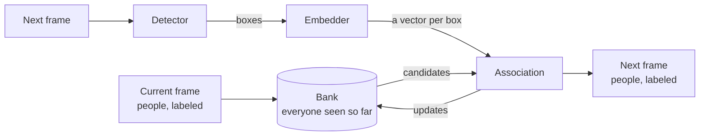
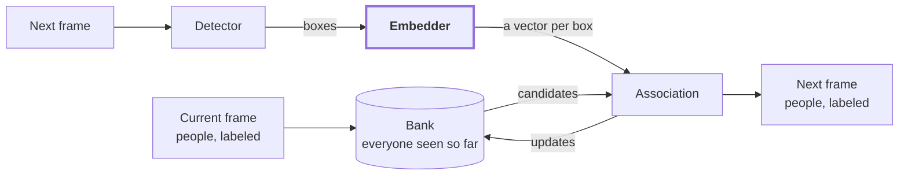
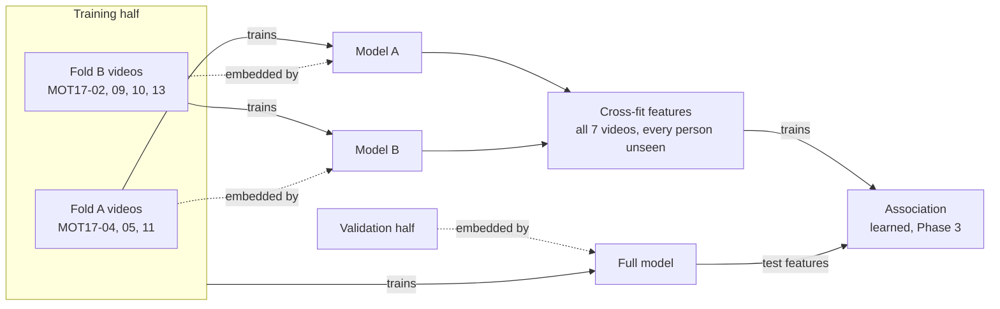
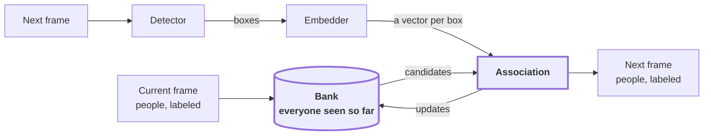

# Spatial-Aware Multi-Person Re-Identification

<!-- Lead with the current output: a sample, then the demo. Write once the project is done. -->



*The tracker, one frame at a time.*

This project builds on a presentation my groupmates, Mark Gallardo and Caine Bautista, and I delivered at the 8th Collaborative Online International Learning (COIL) Conference. Our approach at the time scored each pair of people, one from the current frame and one from the next, in isolation. When following one person, the best-scoring match decided which person in the next frame, if any, was the tracked one. When tracking everyone, the scores went through Hungarian matching[^kuhn]. Attention mixed three inputs per pair: a learnable summary token, the difference between the two people's appearance embeddings, and their element-wise product. The summary token's output was combined with spatial and temporal features (position offsets, overlap, scale, time gap) to produce a match score.

Scoring pairs in isolation has a blind spot: **one match can't inform another.** So I wanted to match everyone at once, with the spatial features from the original project guiding it.

Trackers also tend to lose people who stay hidden for more than a moment. In the training videos of MOT17, the 2017 Multiple Object Tracking benchmark[^mot16], 47 of the 587 occlusions last longer than two seconds[^stats], twice ByteTrack's default wait of one second[^bytetrack]. So when a person loses their detection, whether behind an obstacle or off-screen, they go into a **bank** that remembers their appearance and last known state, and decides how long to keep them before calling them gone. The same bank lets the tracker re-identify people who leave the frame and come back.

Every result below is on the MOT17 validation half (Phase 0 explains the split), with the same public detections for every tracker, unless a table says otherwise. Those detections come from the Faster Region-based Convolutional Neural Network (Faster R-CNN)[^fasterrcnn], labeled FRCNN in MOT17's files.

## Phase 0: The dataset

### Where it comes from

I use [MOT17](https://motchallenge.net/data/MOT17/)[^mot16], the standard benchmark for tracking pedestrians. It has 14 short videos of pedestrian scenes, some from static cameras and some filmed while walking or driving. Seven are for training and come with ground truth: every person is boxed in every frame, with an identity number (ID) and a visibility score from 0 to 1 for how much of them is showing. The other seven are the test set, with no public ground truth.

### What it looked like, and what I fixed

Before running a single evaluation, I went through the release and found seven problems:

| Found | Fixed |
|---|---|
| Every video shipped three times, once per public detector: Deformable Part Models (DPM)[^dpm], FRCNN, and Scale-Dependent Pooling (SDP)[^sdp]. Images and ground truth are identical across the copies | Verified all 14 by content hash and collapsed them into one copy, with the three detection files side by side. That saves 3.9 GB and closes a quiet leak: split by detector folder, and the same video lands in both training and validation |
| Detection files out of frame order, including 246 rows in MOT17-02's FRCNN file | Sorted on load |
| DPM uses ten columns and unbounded scores (−0.5 to 4.77); FRCNN and SDP use seven, with scores between 0 and 1 | One parser for all three, with a score threshold per detector |
| Boxes as 1-based `left, top, width, height` | 0-based corners internally, converted back when writing results |
| 14.6% of pedestrian boxes, about one in seven, extend past the image border | Clipped before cropping |
| Static people, people on vehicles, and reflections labeled next to pedestrians | Only pedestrians marked for evaluation count as targets, following the benchmark rules[^mot16] |
| People stay annotated while fully hidden, so their crops show whatever is in front of them. Nearly one training crop in five (18.9%) has visibility below 0.2 | Kept out of the appearance model's training data |

Last, I cut each training video in time: the first half for training, the second for validation, which I'll call the training half and the validation half. This is CenterTrack's convention[^centertrack], which keeps the results comparable with published work. The test videos stay untouched.

### What it looks like now

```
data/mot17/
├── manifest.json       per video: frame rate, size, moving camera or not, split boundaries
├── train/MOT17-02/     one copy of each of the 7 training videos
│   ├── img1/           frames
│   ├── det/            DPM.txt, FRCNN.txt, SDP.txt
│   ├── gt/gt.txt
│   └── seqinfo.ini
├── test/               the 7 test videos, same layout, no ground truth
└── trackeval/          ground truth per split, in the format the scorer reads
```

In the table below, FPS is frames per second. A *gap* is a stretch where a person's visibility drops below 0.1 and later recovers, and "mostly hidden" is the share of boxes with visibility below 0.25.

| Sequence | FPS | Frames | Size | Camera | People | Boxes | Mostly hidden | Past border | Gaps | > 1 s | > 2 s | Longest |
|---|---|---|---|---|---|---|---|---|---|---|---|---|
| MOT17-02 | 30 | 600 | 1920×1080 | static | 62 | 18,581 | 49.4% | 1.7% | 144 | 55 | 24 | 11.0 s |
| MOT17-04 | 30 | 1050 | 1920×1080 | static | 83 | 47,557 | 16.3% | 26.0% | 43 | 11 | 7 | 8.9 s |
| MOT17-05 | 14 | 837 | 640×480 | moving | 133 | 6,917 | 31.1% | 22.4% | 112 | 12 | 3 | 8.6 s |
| MOT17-09 | 30 | 525 | 1920×1080 | static | 26 | 5,325 | 29.7% | 11.1% | 41 | 12 | 5 | 7.0 s |
| MOT17-10 | 30 | 654 | 1920×1080 | moving | 57 | 12,839 | 17.8% | 3.9% | 110 | 12 | 4 | 2.8 s |
| MOT17-11 | 30 | 900 | 1920×1080 | moving | 75 | 9,436 | 20.3% | 7.2% | 41 | 7 | 4 | 2.8 s |
| MOT17-13 | 25 | 750 | 1920×1080 | moving | 110 | 11,642 | 13.9% | 3.5% | 96 | 1 | 0 | 1.4 s |
| **Total** | | **5,316** | | | **546** | **112,297** | **23.6%** | **14.6%** | **587** | **110** | **47** | **11.0 s** |

Three numbers shaped everything after this:

- **Nearly a quarter of all boxes are mostly hidden**, and on MOT17-02 it's half.
- **Frame rates range from 14 to 30 FPS**, so every time limit is in seconds, not frames.
- **Four of the seven cameras move.**

One more is worth knowing: **152 of the 339 people in the validation half, 45%, also appear in the training half.** An appearance model could simply memorize them, and Phase 2 has to account for that.

## Phase 1: Baselines

### Why a baseline

A tracking score means little on its own. The same tracker scores differently with different detections, splits, and scorers, and published results mostly come from each paper's own detector, so they can't be lined up against mine. So I built my own reference points: three standard trackers, run under exactly the conditions my tracker will face.

- **SORT**[^sort], short for Simple Online and Realtime Tracking, matches people by motion only.
- **ByteTrack**[^bytetrack] adds a second pass that recovers low-confidence detections.
- **DeepSORT**[^deepsort] adds an appearance memory. Here it uses the Omni-Scale Network (OSNet)[^osnet], trained on the Multi-Scene Multi-Time person dataset (MSMT17)[^msmt17]. It looks up the closest-looking person and stores every sighting, which makes it the simplest version of the bank.

### Running them under the same conditions

- **Same detections.** Every tracker gets the public FRCNN boxes, so detection quality is fixed and any difference comes from association, meaning deciding which box belongs to whom.
- **Tuned on one half, scored on the other.** Every threshold was tuned on the training half and reported on the validation half, so no number was tuned on the data it's scored on.
- **Same code path.** I reimplemented all three from their papers, so they share one data loader, one runner, and one scorer. That also keeps this repository Apache-2.0, since the original SORT and DeepSORT code is under the GNU General Public License (GPL).

**A scorer I checked first.** Scoring uses TrackEval[^hota], which reports these:

| Metric | Stands for | Measures |
|---|---|---|
| HOTA | Higher Order Tracking Accuracy[^hota] | detection and association together, by combining the next two |
| DetA | Detection Accuracy | how well people are found and placed |
| AssA | Association Accuracy | how well each person keeps one ID over time |
| MOTA | Multiple Object Tracking Accuracy[^clear] | misses, false alarms, and ID switches in one number, dominated by detection |
| IDF1 | Identification F1 score[^idf1] | how many boxes carry the right ID |
| ID switches | | how often a person's ID changes; the only one where lower is better |

A perfect score only means something if a bad tracker can't get one. So I scored two extremes: the cleaned ground truth as if it were tracker output, and the raw detections with no tracking at all, a new ID for every box.

| Output | HOTA | DetA | AssA | MOTA | IDF1 | ID switches |
|---|---|---|---|---|---|---|
| Ground truth | 100.0 | 100.0 | 100.0 | 100.0 | 100.0 | 0 |
| FRCNN detections, no tracking | 5.0 | 43.6 | 0.6 | −0.7 | 0.7 | 26,306 |

The ground truth gets a perfect 100. The untracked detections keep a DetA of 43.6 while AssA falls to **0.6**: the scorer punishes lost identities without touching detection.

The baselines on the validation half:

| Tracker | HOTA | AssA | IDF1 | ID switches | Matching time |
|---|---|---|---|---|---|
| SORT | 48.4 | 56.2 | 54.5 | 222 | 0.53 ms/frame |
| ByteTrack | 49.4 | 57.7 | 56.2 | 198 | 0.79 ms/frame |
| DeepSORT + OSNet | **51.3** | **62.6** | **59.9** | **121** | 1.83 ms/frame |

DeepSORT makes **39% fewer ID switches** than ByteTrack, 121 against 198, and scores 1.9 HOTA higher. **It's the bar to clear.**

### How my tracker will be measured against them

- **HOTA first**, since it's the one number that covers both detection and association. With the detections fixed, DetA should barely move, so the differences will show up in **AssA**, **IDF1**, and **ID switches**.
- **Same features.** Whenever the appearance model changes, DeepSORT gets the same one, so a win can't come from better features alone.
- **Every part against its plain version.** Each part of my tracker has a simpler counterpart in DeepSORT, and it has to beat that counterpart on the validation half to stay.
- **Repeated runs.** Anything learned is trained more than once and reported as mean ± standard deviation.
- **Time.** The budget is 33 ms per frame, 30 frames per second, on my laptop's RTX 4050, so matching time is reported next to accuracy.

## Phase 2: The appearance model

### Where it fits



The embedder is the appearance model this phase trains. It crops each detected box out of the frame and turns it into a vector of 512 numbers. For now the detector is MOT17's public FRCNN boxes. The bank and association are Phase 3.

### What it does

The COIL version compared people inside a model: attention over each pair's embedding difference and product. That's one model run per pair, and the number of pairs grows with the square of the crowd. So this phase moves the comparing into training instead. **The appearance model turns each crop into a vector once, and comparing two people is a single dot product**, their cosine similarity. It's trained so crops of the same person land close together and different people land far apart.

| | Per frame, with N new boxes and M known people |
|---|---|
| A model on every pair | N × M model runs |
| An embedding per crop | N model runs, then N × M dot products |

On MOT17-04, with about 27 people in every frame, that's roughly 729 model runs against 27, 27× fewer.

### How it's trained

**The candidates.** I trained three: OSNet x1.0, the full-width model, as the accuracy reference, and two faster ones, OSNet x0.5 (half the channels) and ResNet18, an 18-layer residual network[^resnet]. I timed every candidate before training any of them, and ResNet18 surprised me. It does twice the arithmetic per crop of OSNet x1.0 and still ran faster at every batch size I tried, because the graphics processor (GPU) is built for its dense convolutions.

**The crops.** I cut a crop of every visible pedestrian (visibility at least 0.3) in the training half, with the same GPU cropping the tracker uses, so training and tracking see identical pixels. Scrolling through them turned up crops that were just legs. The cause: MOT17's visibility score counts occlusion by other people but ignores the image border, so someone half outside the frame can still read as fully visible. Dropping anyone less than 60% inside the frame removed 1,290 crops, 3.0% of them, and left **41,978 crops of 325 people**.

**The recipe.** Training follows *Bag of Tricks*[^bagoftricks]: an identity classifier with label smoothing, plus a triplet loss[^triplet] that pulls each person's least similar crop closer than their most similar stranger. I changed two things for tracking:

- **Every batch comes from one video.** Sixteen people from the same sequence share its lighting and background, which are exactly the look-alikes the tracker has to tell apart.
- **Each person's four crops come from four different stretches of their track.** Matching across time is harder than matching neighboring frames, and it's what the bank needs.

Augmentations cover the camera problems I wanted the model to shrug off: brightness, contrast, saturation, and warmth changes, a lighting change across part of the crop, random erasing[^erasing] for partial blocking, plus flips and small shifts.

**The score.** I cut 11,555 crops of 305 people from every third frame of the validation half. Only people the model has never seen are used as queries, since 45% of validation people also appear in training (Phase 0). Each query searches for the same person among everyone else in its video, and I report mean average precision (mAP), meaning how high the right person's crops rank on average, and Rank-1, meaning how often the top result is the right person. Crops of the same person within a second of the query don't count, so near-identical neighboring frames can't inflate the score. Everything downstream uses the final checkpoint, not the best-scoring one, because picking by validation score would leak the validation half into the choice.

| Model | Starts from | Parameters | mAP | Rank-1 |
|---|---|---|---|---|
| OSNet x1.0, off the shelf | MSMT17 | 2.2 M | 71.2 | 80.8 |
| OSNet x1.0, fine-tuned | MSMT17 | 2.2 M | 77.9 | **88.1** |
| OSNet x0.5, fine-tuned | MSMT17 | 0.6 M | **78.1** | **88.1** |
| ResNet18, fine-tuned | ImageNet | 11.2 M | 75.5 | 86.6 |

Fine-tuning added **6.7 mAP** and **7.3 points of Rank-1** to OSNet x1.0 on people it never saw. OSNet x0.5 matched it with **a quarter of the parameters**, 78.1 against 77.9, a gap smaller than its own score moved over the last five epochs (77.5 to 78.1). ResNet18 finished 2.4 mAP behind, starting from ImageNet rather than a person dataset.

### Choosing the model

mAP only says how well a model finds people. What the tracker needs is how well it tracks and how long it takes. So I ran DeepSORT on the validation half with each model's features, and timed each model cropping and embedding every detection on the real validation frames.

Each model gets its own DeepSORT cutoff, set without labels. Two detections in the same frame are always different people, so the cutoff is whatever lets through the same share of same-frame pairs, 0.118%, as DeepSORT's tuned 0.2 did with the off-the-shelf features.

| Model | Cutoff | HOTA | AssA | IDF1 | ID switches | Embed, plain | Embed, graphed |
|---|---|---|---|---|---|---|---|
| OSNet x1.0 | 0.368 | **51.9** | **63.8** | **60.8** | **98** | 15.0 ms | 9.5 ms |
| OSNet x0.5 | 0.375 | **51.9** | 63.7 | 60.6 | 102 | 13.9 ms | 5.4 ms |
| ResNet18 | 0.312 | 51.5 | 62.8 | 59.9 | 106 | **5.2 ms** | 5.9 ms |

(Embedding time is per validation frame, averaged over all seven videos, cropping included. *Graphed* means replayed as a CUDA graph: NVIDIA's Compute Unified Device Architecture records the model's GPU work once and replays it as a single launch.)

**OSNet x0.5 it is.** It tracks as well as OSNet x1.0, 51.9 HOTA each, at 5.4 ms against 9.5 ms, **1.8× faster**. ResNet18 is 0.2 ms faster still, but gives up 0.4 HOTA, 0.9 AssA, and 4 more ID switches against x0.5.

The graphs are doing more work than it looks. Without them, x0.5 takes 13.9 ms, because at these batch sizes its time goes into launching its many small layers, not into the math. ResNet18 gets nothing from them, 5.2 ms plain against 5.9 ms graphed, since padding each frame's crops up to a fixed batch size costs more than the launches it saves.

Each model was trained once, and 0.4 HOTA is a small gap. The choice doesn't hinge on it, though: x0.5 and x1.0 tie on accuracy, and at equal accuracy the faster model wins.

### Cross-fitting



This is the part I'd point at first.

**Why it's needed.** The association step is learned too. It looks at pairs of a known person and a new box, and learns from the training half how far to trust appearance similarity against position and timing. So it needs appearance vectors for the training half, and the obvious source is the fine-tuned model. That's the problem: the fine-tuned model trained on every person in the training half. I measured what its features look like on those same people:

| Training-half features made by | OSNet x0.5 | OSNet x1.0 |
|---|---|---|
| The off-the-shelf model, which never saw MOT17 | 69.0 | 71.1 |
| The full fine-tuned model, which trained on these people | **99.7** | **100.0** |
| Cross-fit: each video embedded by the other fold's model | 71.6 | 70.7 |

(mAP over all seven training videos, with every person in the training half as a query and the same scoring rules as above.)

**A near-perfect score.** On the people it trained on, the full model practically never ranks a stranger above the right person. On new people it scores 78.1 (x0.5) and 77.9 (x1.0). An association step trained on those features would learn that appearance is never wrong, and then meet appearance that's wrong a fair share of the time. I found this the hard way: a matcher trained on x1.0's full-model features scored a perfect 100 average precision on its own held-out check. That's a leak, not a result.

The cross-fit features score **71.6** for x0.5, a little below the 78.1 the full model reaches on new people. Each fold model trained on about half the data, so its features are slightly worse than the ones used at test time. That errs on the safe side: the association step learns to trust appearance a bit less than it could, rather than more. (The training-half crops are every frame and the validation ones every third frame, so 71.6 and 78.1 are only roughly comparable.)

**What I did.**

1. Split the seven training videos into two folds by video. Each training video is a different scene, so no person lands in both folds, and each fold mixes static and moving cameras.
2. Trained one model per fold, with the full model's exact recipe and starting weights, on that fold's training-half crops only. I did this for OSNet x1.0 first and again for OSNet x0.5 once it was chosen. Each pair took about as long as training the full model once: 43 minutes for x0.5, 69 for x1.0.
3. Had each fold model embed every detection in the *other* fold's videos, and saved both halves into one shared set of features covering all seven videos.
4. The association step trains on those features. When tracking the validation half, it gets the full model's features instead.

The fold models have that one job. They aren't candidates for the tracker, and nothing is merged, averaged, or distilled from them. Neither has a validation set of its own: the validation half is only used to score them, and like every model here they keep their final checkpoint.

**How the fold models perform.** On unseen validation people, as mAP / Rank-1:

| Model | Trained on | Embeds | OSNet x0.5 | OSNet x1.0 |
|---|---|---|---|---|
| Fold A | MOT17-04, 05, 11 | MOT17-02, 09, 10, 13 | 74.5 / 85.3 | 73.1 / 84.6 |
| Fold B | MOT17-02, 09, 10, 13 | MOT17-04, 05, 11 | 78.2 / 90.7 | 79.5 / 90.3 |
| Full | all seven | the validation half, at test time | 78.1 / 88.1 | 77.9 / 88.1 |

Each model is scored on the people *it* never saw, which is a different set for each, so the rows can't be compared with each other. They only show that each model learned something. The training-half table is the fairer comparison. There, against the off-the-shelf model on the same videos, the fold models range from 3.2 mAP behind (x1.0's fold B model on fold A's videos) to 4.9 ahead (x0.5's fold A model on fold B's). Three or four scenes of training carry only a little into scenes a model has never seen.

**What it changed.** With x1.0's cross-fit features, the association step's held-out check reads **98.0** average precision (93.2% precision, 96.8% recall) instead of a suspicious 100.

## Phase 3: The tracker

### Where it fits



This phase is the bank and the association step. The embedder from Phase 2 hands them one vector per box, and everything else they use is motion, position, and memory.

### The bank

Every person the tracker knows about is an entry in the bank:

| Holds | How |
|---|---|
| Motion | a Kalman filter over the box's center, aspect ratio, and height, plus their velocities, which predicts where the box should be next frame |
| Appearance | a running average of the person's vectors, plus up to four distinct views |
| Where they were | the box they were last matched to |
| State | *tentative* (new, unconfirmed), *active* (seen last frame), *occluded* (lost inside the frame), or *exited* (last seen at the edge, walking out) |

Each frame, the tracker:

1. **Retrieves** the likely candidates from the bank for every new box.
2. **Scores** every (person, box) pair.
3. **Matches** everyone in one assignment, and lets a box become a new person when nobody fits.
4. **Writes** back only clean sightings: confident, and not overlapped by someone else.
5. **Forgets** entries gone too long for their state: 5 s for an occluded person, 0.5 s for one who walked out of frame, since MOT17 gives returning people new IDs.

### From hand-set rules to a learned matcher

I started with scoring rules set by hand: appearance only counts where the motion model finds the position plausible, and a hidden person is only recalled if they look close enough. With the OSNet x0.5 features, those rules land at **51.8 HOTA and 123 ID switches**, level with DeepSORT on HOTA and 21 switches worse. Tuning them further moved HOTA by less than half a point.

The rules were the ceiling. Each piece of evidence gets a fixed weight and a fixed cutoff, but the right weighting depends on the situation: after two seconds hidden, appearance should count more and position less, and in a crowd, overlap proves little. So I replaced the scoring step with a small network that learns the weighting from examples.

**What it sees.** Each (person, box) pair is described by 22 numbers, which I'll call cues:

| Group | Cues |
|---|---|
| Appearance | similarity to the person's best stored view and to their running average, plus each as a rank against same-frame pairs, the label-free trick from "Choosing the model" |
| Position, against the motion prediction | overlap, center offset, size change, and corner offsets, all divided by the person's height, plus the Mahalanobis distance, meaning how surprising the box is given how uncertain the motion model is |
| Position, against where they were | overlap with the box the person was last matched to |
| Memory | seconds since last seen, state, how often they've been seen, detection confidence, and how crowded the box is |

**What it is.** A multilayer perceptron (MLP) with two hidden layers and about 5,700 parameters, which turns the 22 cues into one probability: same person. The assignment step uses 1 minus that probability as the cost and matches everyone at once with the Hungarian method[^kuhn]. A pair below 0.5 is rejected, and an unmatched box becomes a new person.

**What it learns from.** I ran the hand-set tracker over the training half with the cross-fit features from Phase 2 and recorded every pair it considered: **950,127 pairs**, 3.4% of them the same person. Each box takes the identity of the ground-truth box it overlaps (intersection over union, IoU, at least 0.5), and each bank entry the identity it has been matched to most often. So the network learns from the situations the tracker actually gets into, including its own mistakes[^learningtotrack]. On two training videos held out from its training, it recognizes same-person pairs with 96.5 average precision (91.1% precision, 98.2% recall).

### The cue that mattered: where they were

This is the part I'd point at first.

The first learned matcher had 21 cues, everything above except "where they were". It beat DeepSORT on every overall number and lost on ID switches, 107 against 102. So I went through every switch and sorted it by what happened:

| Why the ID changed | Learned, 21 cues | Learned, 22 cues (mean of 4 runs) | DeepSORT |
|---|---|---|---|
| **Swap:** took an ID that belonged to someone else | 44 | 40.0 | 36 |
| **Flip back:** switched away, then back a moment later | 31 | 28.0 | 19 |
| **Lost, then restarted** as a new ID | 31 | 28.5 | 41 |
| Other | 2 | 3.0 | 6 |
| **Total** | 108 | 99.5 | 102 |

The bank does its job: it restarts people as new IDs 30% less often than DeepSORT does (28.5 against 41), which is the long-gap memory from the introduction working. What it loses is short-range. Swaps and flip-backs happen between two people who are both in view, with typical gaps of 0.03 to 0.25 s. Every position cue in the 21-cue matcher measured against the motion model's *prediction*, which drifts when someone slows down, turns, or goes undetected for a frame. None of them said where the person actually was.

So I added one cue, the overlap with the box each person was last matched to. It cut ID switches from 107 to **98.3** on average over six training runs, below DeepSORT's 102, with HOTA unchanged.

### Results

On the validation half, with the same public detections and the same OSNet x0.5 features for every tracker that uses appearance:

| Tracker | HOTA | AssA | IDF1 | ID switches | Matching time |
|---|---|---|---|---|---|
| SORT | 48.4 | 56.2 | 54.5 | 222 | 0.53 ms/frame |
| ByteTrack | 49.4 | 57.7 | 56.2 | 198 | 0.79 ms/frame |
| DeepSORT, calibrated cutoff | 51.9 | 63.7 | 60.6 | 102 | 2.76 ms/frame |
| Mine, hand-set rules | 51.8 | 63.1 | 60.7 | 123 | 1.58 ms/frame |
| Mine, learned, 21 cues | 52.6 ± 0.0 | 64.9 ± 0.1 | 61.8 ± 0.0 | 107 (106–108) | 4.49 ms/frame |
| **Mine, learned, 22 cues** | **52.6 ± 0.1** | **64.8 ± 0.2** | **61.7 ± 0.1** | **98.3** (95–108) | 4.86 ms/frame |

(Learned rows are the mean ± standard deviation over 3 and 6 training runs. The last four timings were measured back to back; SORT and ByteTrack are from Phase 1's sitting.)

The final tracker beats DeepSORT by **0.7 HOTA, 1.1 AssA, and 1.1 IDF1**, and holds that lead on every run. It averages 3.7 fewer ID switches, but that part doesn't hold on every run: see [Limitations](#limitations). Matching costs 4.9 ms per frame, 1.8× DeepSORT's rules. Added to 4.0 ms of decoding and 5.4 ms of embedding (both measured in Phase 1 and 2), that's about 14 ms of the 33 ms budget, which leaves roughly 19 ms for a detector.

That covers every promise from "How my tracker will be measured": HOTA first, the same features for DeepSORT, the learned scoring against the hand-set version of itself, repeated runs, and time next to accuracy.

### What didn't work

I tried six ways to push the ID switches down further. None survived:

| Tried | Idea | Validation result | Verdict |
|---|---|---|---|
| Attention across pairs | a "context" model in which each pair's score sees its rivals before the assignment | 51.7 HOTA; 149, 379, and 167 ID switches over 3 runs | dropped |
| On-policy recording | retrain on pairs recorded while the learned matcher drives the tracker, three rounds fixed in advance | attention: 126 to 296 ID switches; pairwise: 109 on average | dropped |
| Competition margins | four cues for how clearly a pair beats its best rival | 112 ID switches on average | dropped |
| Camera compensation | shift every prediction by the measured camera motion, as BoT-SORT does[^botsort] | 98.5 on average with it, 98.3 without, +0.15 HOTA, 24 ms per frame | off |
| Seed ensembles | average the probabilities of five matchers | 103 and 96 ID switches | not adopted |
| Hysteresis | a switch has to beat last frame's pairing by a set margin | 100.5 and 104.3 on average (margins 0.05 and 0.1), against 99.5 without | off |

**The pattern.** Everything that looked at the *other* candidates made tracking worse. Who else is in the bank depends on the tracker's own earlier decisions, so evidence about rivals shifts as soon as the matcher's choices differ from the ones it was trained on. The attention model shows it most plainly: on held-out pairs it reached 94.6% precision against the pairwise matcher's 89.7%, and inside the tracker it produced up to 379 ID switches. Evidence about the pair itself, like where the person was, carried over.

**Most of these were detours I could have skipped.** Five of the six compared effects of 3 to 10 ID switches using three runs each, when a single run swings by more than 10. Measuring that noise first would have ruled most of them out before they started. Camera compensation is the clearest case. It looked like it helped until six runs each showed it didn't, and for surveillance, where cameras don't move, it would do nothing anyway.

## Limitations

**ID switches beat DeepSORT on average, not every time.** Single training runs land anywhere from 95 to 108 switches, while DeepSORT stays at 102 to 103 however I nudge its cutoff. One flipped decision early in a video changes everything after it, and a learned matcher makes more close calls than fixed rules do.

**The appearance model has met 45% of the validation people.** Its mAP is scored on unseen people only, but the tracking numbers include the 152 people who also walk through the training half. DeepSORT uses the same features, so the comparison is fair. The absolute numbers are probably a little flattered.

**Hidden people aren't reported.** MOT17 keeps annotating people while they're hidden. On the training half, showing each hidden person's predicted box for 0.6 s raised HOTA by 1.0, and ID switches by 30%, from 156 to 202, because the predicted box drifts onto whoever is nearby. So it stays off by default.

**No detector in the loop yet.** Every number here uses MOT17's public detections, so the real-time claim rests on adding up measured parts, not on timing the whole pipeline.

**Re-entry is untested.** The bank can bring back someone who walked out and returned, but MOT17 gives returning people new IDs, so that mode is off in every number above.

## Usage

Requires [uv](https://docs.astral.sh/uv/). On Windows and Linux, `uv sync` installs PyTorch built for CUDA 13.0.

```bash
uv sync
```

### Data

Extract the MOT17 release so that `MOT17/train` and `MOT17/test` sit at the repository root, then:

```bash
uv run python -m reidtrack.data.prepare --raw MOT17 --out data/mot17
uv run python -m reidtrack.data.stats --root data/mot17
```

`prepare` verifies and deduplicates the release into `data/mot17` and exports the splits for evaluation. It writes nothing if the copies differ. Afterwards `MOT17/` can be deleted. `stats` prints the per-sequence figures quoted above. MOT17 is not part of this repository and remains under its own terms.

### Baselines

```bash
uv run python -m reidtrack.retrieval.cache --weights data/weights/osnet_x1_0_msmt17.pth
uv run python -m reidtrack.baselines sort --min-score 0.5
uv run python -m reidtrack.baselines bytetrack
uv run python -m reidtrack.baselines deepsort --min-score 0.5 --max-cosine 0.2
```

`cache` embeds every public detection with OSNet[^osnet] and stores the vectors under `data/mot17/cache/`. The MSMT17-trained weights come from the torchreid model zoo[^torchreid]. `baselines` runs my reimplementations of SORT[^sort], ByteTrack[^bytetrack] and DeepSORT[^deepsort]. Results and scores go to `runs/<name>/`.

### Appearance model

```bash
uv run python -m reidtrack.retrieval.crops --split train_half
uv run python -m reidtrack.retrieval.crops --split val_half --stride 3
uv run python -m reidtrack.retrieval.bench
uv run python -m reidtrack.retrieval.train --backbone osnet_x0_5 --init data/weights/osnet_x0_5_msmt17.pth
uv run python -m reidtrack.retrieval.cache --weights data/weights/retriever/osnet_x0_5_mot17/last.pt --model osnet_x0_5_mot17
uv run python -m reidtrack.baselines --name deepsort_osnet_x0_5 deepsort --embeddings osnet_x0_5_mot17 --min-score 0.5 --max-cosine 0.375
```

- **`crops`** cuts the training and scoring crops.
- **`bench`** times candidate models.
- **`train`** fine-tunes one. Press Ctrl+C, or create a file named `PAUSE` in its run folder, to pause; run the same command with `--resume` to continue.
- **`cache`** embeds every detection with the fine-tuned model.
- **`baselines deepsort`** tracks with it, at its label-free cutoff from "Choosing the model".

These commands build the chosen OSNet x0.5. Swap in `--backbone osnet_x1_0` or `resnet18` for the others.

Cross-fitting trains one model per fold and has each embed the other fold into a shared cache:

```bash
uv run python -m reidtrack.retrieval.train --backbone osnet_x0_5 --init data/weights/osnet_x0_5_msmt17.pth --name osnet_x0_5_foldA --sequences MOT17-04,MOT17-05,MOT17-11
uv run python -m reidtrack.retrieval.train --backbone osnet_x0_5 --init data/weights/osnet_x0_5_msmt17.pth --name osnet_x0_5_foldB --sequences MOT17-02,MOT17-09,MOT17-10,MOT17-13
uv run python -m reidtrack.retrieval.cache --weights data/weights/retriever/osnet_x0_5_foldA/last.pt --model osnet_x0_5_crossfit --sequences MOT17-02,MOT17-09,MOT17-10,MOT17-13
uv run python -m reidtrack.retrieval.cache --weights data/weights/retriever/osnet_x0_5_foldB/last.pt --model osnet_x0_5_crossfit --sequences MOT17-04,MOT17-05,MOT17-11
```

### Tracker

```bash
uv run python -m reidtrack --embeddings osnet_x0_5_mot17
uv run python -m reidtrack.association.train --embeddings osnet_x0_5_crossfit --name pairwise_osnet_x0_5
uv run python -m reidtrack --embeddings osnet_x0_5_mot17 --reranker data/weights/reranker/pairwise_osnet_x0_5.pt
```

- **`python -m reidtrack`** runs my tracker on the validation half, with the hand-set rules unless a `--reranker` is given. `--set key=value` changes any setting, for example `--set hysteresis=0.05` or `--set emit_hidden=0.6`. `--camera` turns on camera compensation, and `--interpolate FRAMES` fills short gaps after tracking, which makes the result offline.
- **`association.train`** records candidate pairs from the tracker on the training half, trains the learned matcher on them, and reports the held-out check. `--model context` trains the attention version, and `--rounds 3` adds on-policy rounds.

### Evaluation

```bash
uv run python -m reidtrack.eval --results runs/<tracker> --split val_half
uv run python -m reidtrack.eval --oracle
```

Result files are one `<sequence>.txt` per sequence in MOT format, using the sequence's own frame numbers; rows outside the split are ignored. Scoring uses TrackEval[^hota]. `--oracle` scores the ground truth itself and must report 100.

### Visualization

```bash
uv run python -m reidtrack.viz MOT17-02 --gt --split val_half --scale 0.5
uv run python -m reidtrack.viz MOT17-02 --results runs/<tracker>/MOT17-02.txt --frame 340
```

Writes an MP4, or a PNG for a single `--frame`, to `runs/viz/`. People who are annotated but hidden are drawn dashed.

### Latency

```bash
uv run python -m reidtrack.eval.latency --seq MOT17-04
```

Benchmarks reading and decoding frames. `StageTimer` in `reidtrack.eval.latency` times the stages of a pipeline.

### Tests

```bash
uv run pytest
```

## License

Apache-2.0; see [LICENSE](LICENSE). `src/reidtrack/retrieval/osnet.py` is adapted from deep-person-reid[^torchreid] under the MIT License, whose notice is kept in that file. Pretrained weights and datasets are not included and remain under their own terms.

[^kuhn]: H. W. Kuhn. The Hungarian method for the assignment problem. *Naval Research Logistics Quarterly*, 2(1–2):83–97, 1955.
[^stats]: Measured on the MOT17 training set with `python -m reidtrack.data.stats`. An occlusion here is a stretch in which a person's visibility drops below 0.1 and later recovers.
[^bytetrack]: Y. Zhang et al. ByteTrack: Multi-Object Tracking by Associating Every Detection Box. *ECCV*, 2022. [arXiv:2110.06864](https://arxiv.org/abs/2110.06864). The reference implementation keeps a lost track for 30 frames (`track_buffer`), scaled to the frame rate.
[^mot16]: A. Milan, L. Leal-Taixé, I. Reid, S. Roth, K. Schindler. MOT16: A Benchmark for Multi-Object Tracking. [arXiv:1603.00831](https://arxiv.org/abs/1603.00831), 2016. Annotation rules in §2; evaluation classes in §4.
[^fasterrcnn]: S. Ren, K. He, R. Girshick, J. Sun. Faster R-CNN: Towards Real-Time Object Detection with Region Proposal Networks. *NeurIPS*, 2015. [arXiv:1506.01497](https://arxiv.org/abs/1506.01497).
[^dpm]: P. F. Felzenszwalb, R. B. Girshick, D. McAllester, D. Ramanan. Object Detection with Discriminatively Trained Part-Based Models. *IEEE TPAMI*, 32(9):1627–1645, 2010.
[^sdp]: F. Yang, W. Choi, Y. Lin. Exploit All the Layers: Fast and Accurate CNN Object Detector with Scale Dependent Pooling and Cascaded Rejection Classifiers. *CVPR*, 2016.
[^centertrack]: X. Zhou, V. Koltun, P. Krähenbühl. Tracking Objects as Points. *ECCV*, 2020. [arXiv:2004.01177](https://arxiv.org/abs/2004.01177).
[^hota]: J. Luiten et al. HOTA: A Higher Order Metric for Evaluating Multi-Object Tracking. *IJCV*, 2021. [arXiv:2009.07736](https://arxiv.org/abs/2009.07736). Computed with [TrackEval](https://github.com/JonathonLuiten/TrackEval).
[^clear]: K. Bernardin, R. Stiefelhagen. Evaluating Multiple Object Tracking Performance: The CLEAR MOT Metrics. *EURASIP Journal on Image and Video Processing*, 2008.
[^idf1]: E. Ristani, F. Solera, R. Zou, R. Cucchiara, C. Tomasi. Performance Measures and a Data Set for Multi-Target, Multi-Camera Tracking. *ECCV Workshops*, 2016. [arXiv:1609.01775](https://arxiv.org/abs/1609.01775).
[^sort]: A. Bewley, Z. Ge, L. Ott, F. Ramos, B. Upcroft. Simple Online and Realtime Tracking. *ICIP*, 2016. [arXiv:1602.00763](https://arxiv.org/abs/1602.00763).
[^deepsort]: N. Wojke, A. Bewley, D. Paulus. Simple Online and Realtime Tracking with a Deep Association Metric. *ICIP*, 2017. [arXiv:1703.07402](https://arxiv.org/abs/1703.07402).
[^osnet]: K. Zhou, Y. Yang, A. Cavallaro, T. Xiang. Omni-Scale Feature Learning for Person Re-Identification. *ICCV*, 2019. [arXiv:1905.00953](https://arxiv.org/abs/1905.00953).
[^torchreid]: K. Zhou, T. Xiang. Torchreid: A Library for Deep Learning Person Re-Identification in Pytorch. [arXiv:1910.10093](https://arxiv.org/abs/1910.10093), 2019. Code and model zoo: [deep-person-reid](https://github.com/KaiyangZhou/deep-person-reid).
[^msmt17]: L. Wei, S. Zhang, W. Gao, Q. Tian. Person Transfer GAN to Bridge Domain Gap for Person Re-Identification. *CVPR*, 2018. [arXiv:1711.08565](https://arxiv.org/abs/1711.08565).
[^resnet]: K. He, X. Zhang, S. Ren, J. Sun. Deep Residual Learning for Image Recognition. *CVPR*, 2016. [arXiv:1512.03385](https://arxiv.org/abs/1512.03385).
[^bagoftricks]: H. Luo, Y. Gu, X. Liao, S. Lai, W. Jiang. Bag of Tricks and A Strong Baseline for Deep Person Re-identification. *CVPR Workshops*, 2019. [arXiv:1903.07071](https://arxiv.org/abs/1903.07071).
[^triplet]: A. Hermans, L. Beyer, B. Leibe. In Defense of the Triplet Loss for Person Re-Identification. [arXiv:1703.07737](https://arxiv.org/abs/1703.07737), 2017.
[^learningtotrack]: Y. Xiang, A. Alahi, S. Savarese. Learning to Track: Online Multi-Object Tracking by Decision Making. *ICCV*, 2015.
[^botsort]: N. Aharon, R. Orfaig, B.-Z. Bobrovsky. BoT-SORT: Robust Associations Multi-Pedestrian Tracking. [arXiv:2206.14651](https://arxiv.org/abs/2206.14651), 2022.
[^erasing]: Z. Zhong, L. Zheng, G. Kang, S. Li, Y. Yang. Random Erasing Data Augmentation. *AAAI*, 2020. [arXiv:1708.04896](https://arxiv.org/abs/1708.04896).
