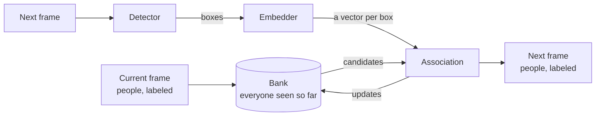
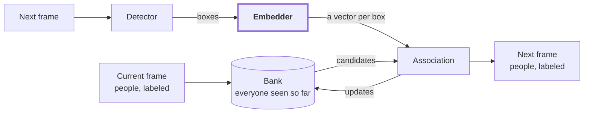
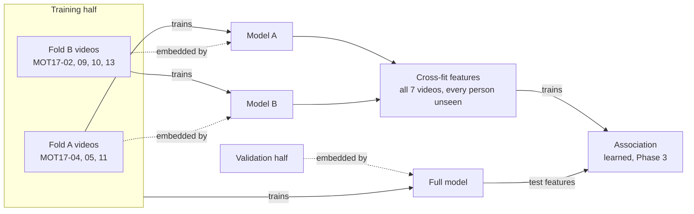
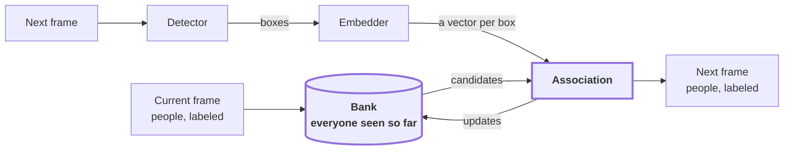
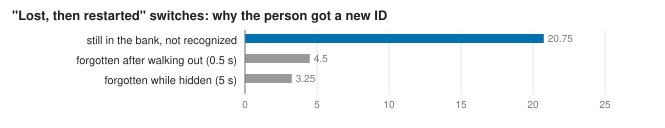
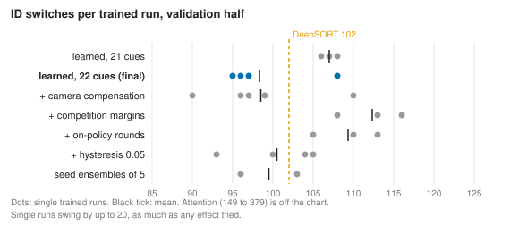
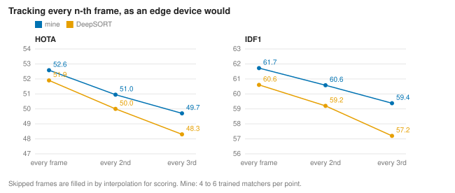

# Spatial-Aware Multi-Person Re-Identification

<!-- Lead with the current output: a sample, then the demo. Write once the project is done. -->


Seen above: The tracker on MOT17-08, a test video that no model in this project trained on, with my fine-tuned detector, appearance model, and matcher. Each box carries the ID the tracker gave that person, and the bottom right shows how long each stage took on that frame, in milliseconds, on my laptop's RTX 4050. Footage from MOT17 [[2]](#ref-2), CC BY-NC-SA 3.0.



Seen above: A diagram of the tracker's pipeline, frame by frame.

This project builds on a presentation my groupmates, Mark Gallardo and Caine Bautista, and I delivered at the 8th Collaborative Online International Learning (COIL) Conference. Our approach at the time scored each pair of people, one from the current frame and one from the next, in isolation. When following one person, the best-scoring match decided which person in the next frame, if any, was the tracked one. When tracking everyone, we ran the scores through Hungarian matching [[1]](#ref-1). Attention mixed three inputs per pair: a learnable summary token, the difference between the two people's appearance embeddings, and their element-wise product. We combined the summary token's output with spatial and temporal features (position offsets, overlap, scale, time gap) to produce a match score.

Scoring pairs in isolation has a blind spot: one match can't inform another. So I wanted to match everyone at once, with the spatial features from the original project guiding it.

Trackers also tend to lose people who stay hidden for more than a moment. In the training videos of MOT17, the 2017 Multiple Object Tracking benchmark [[2]](#ref-2), 47 of the 587 occlusions last longer than two seconds [[3]](#ref-3), twice ByteTrack's default wait of one second [[4]](#ref-4). So when a person loses their detection, whether behind an obstacle or off-screen, they go into a **bank** that remembers their appearance and last known state, and decides how long to keep them before calling them gone. The same bank lets the tracker re-identify people who leave the frame and come back.

Every result below comes from the MOT17 validation half (Phase 0 explains the split), with the same public detections for every tracker, unless a table says otherwise. Those detections come from the Faster Region-based Convolutional Neural Network (Faster R-CNN) [[5]](#ref-5), which MOT17's files label FRCNN.

## Phase 0: The dataset

### Where it comes from

I use [MOT17](https://motchallenge.net/data/MOT17/) [[2]](#ref-2), the standard benchmark for tracking pedestrians. It has 14 short videos of pedestrian scenes. Some cameras stand still, and others move with a person walking or a car driving. Seven videos are for training and come with ground truth: every person has a box in every frame, with an identity number (ID) and a visibility score from 0 to 1 for how much of them shows. The other seven form the test set, with no public ground truth.

### What it looked like, and what I fixed

Before running a single evaluation, I went through the release and found seven problems:

| Found | Fixed |
|---|---|
| MOT17 ships every video three times, once per public detector: Deformable Part Models (DPM) [[6]](#ref-6), FRCNN, and Scale-Dependent Pooling (SDP) [[7]](#ref-7). The copies share identical images and ground truth | I verified all 14 by content hash and collapsed them into one copy, with the three detection files side by side. That saves 3.9 GB and closes a quiet leak: split the data by detector folder, and the same video lands in both training and validation |
| Several detection files run out of frame order, including 246 rows in MOT17-02's FRCNN file | The loader sorts every file |
| DPM uses ten columns and unbounded scores (−0.5 to 4.77); FRCNN and SDP use seven, with scores between 0 and 1 | One parser reads all three, with a score threshold per detector |
| MOT17 stores boxes as 1-based `left, top, width, height` | The code works in 0-based corners and converts back when it writes results |
| 14.6% of pedestrian boxes, about one in seven, extend past the image border | I clip every box before cropping |
| The ground truth labels static people, people on vehicles, and reflections next to pedestrians | Only the pedestrians that the benchmark rules mark for evaluation [[2]](#ref-2) count as targets |
| MOT17 keeps annotating people while they're fully hidden, so their crops show whatever stands in front of them. Nearly one training crop in five (18.9%) has visibility below 0.2 | I leave those crops out of the appearance model's training data |

Last, I cut each training video in time: the first half for training, the second for validation, which I'll call the training half and the validation half. This is CenterTrack's convention [[8]](#ref-8), which keeps the results comparable with published work. I never touch the test videos.

### What it looks like now

```
data/mot17/
├── manifest.json       per video: frame rate, size, moving camera or not, split boundaries
├── train/MOT17-02/     one copy of each of the 7 training videos
│   ├── img1/           frames
│   ├── det/            DPM.txt, FRCNN.txt, SDP.txt
│   ├── gt/gt.txt
│   └── seqinfo.ini
├── test/               the 7 test videos, same layout, no ground truth
└── trackeval/          ground truth per split, in the format the scorer reads
```

In the table below, FPS means frames per second. A *gap* is a stretch where a person's visibility drops below 0.1 and later recovers, and "mostly hidden" is the share of boxes with visibility below 0.25.

| Sequence | FPS | Frames | Size | Camera | People | Boxes | Mostly hidden | Past border | Gaps | > 1 s | > 2 s | Longest |
|---|---|---|---|---|---|---|---|---|---|---|---|---|
| MOT17-02 | 30 | 600 | 1920×1080 | static | 62 | 18,581 | 49.4% | 1.7% | 144 | 55 | 24 | 11.0 s |
| MOT17-04 | 30 | 1050 | 1920×1080 | static | 83 | 47,557 | 16.3% | 26.0% | 43 | 11 | 7 | 8.9 s |
| MOT17-05 | 14 | 837 | 640×480 | moving | 133 | 6,917 | 31.1% | 22.4% | 112 | 12 | 3 | 8.6 s |
| MOT17-09 | 30 | 525 | 1920×1080 | static | 26 | 5,325 | 29.7% | 11.1% | 41 | 12 | 5 | 7.0 s |
| MOT17-10 | 30 | 654 | 1920×1080 | moving | 57 | 12,839 | 17.8% | 3.9% | 110 | 12 | 4 | 2.8 s |
| MOT17-11 | 30 | 900 | 1920×1080 | moving | 75 | 9,436 | 20.3% | 7.2% | 41 | 7 | 4 | 2.8 s |
| MOT17-13 | 25 | 750 | 1920×1080 | moving | 110 | 11,642 | 13.9% | 3.5% | 96 | 1 | 0 | 1.4 s |
| **Total** | | **5,316** | | | **546** | **112,297** | **23.6%** | **14.6%** | **587** | **110** | **47** | **11.0 s** |

These three numbers decided the design:

- Nearly a quarter of all boxes fall in the mostly hidden group, and on MOT17-02 half of them do.
- Frame rates range from 14 to 30 FPS, so every time limit in the tracker runs in seconds, not frames.
- Four of the seven cameras move.

One more is worth knowing: **152 of the 339 people** in the validation half, 45%, also appear in the training half. An appearance model could simply memorize them, and Phase 2 has to account for that.

## Phase 1: Baselines

### Why a baseline

A tracking score means little on its own. The same tracker scores differently with different detections, splits, and scorers, and published results mostly come from each paper's own detector, so I can't line them up against mine. So I built my own reference points: three standard trackers that face exactly the conditions my tracker will face.

- SORT [[9]](#ref-9), short for Simple Online and Realtime Tracking, matches people by motion only.
- ByteTrack [[4]](#ref-4) adds a second pass that recovers low-confidence detections.
- DeepSORT [[10]](#ref-10) adds an appearance memory. Here it uses the Omni-Scale Network (OSNet) [[11]](#ref-11), which its authors trained on the Multi-Scene Multi-Time person dataset (MSMT17) [[12]](#ref-12). It looks up the closest-looking person and stores every sighting, which makes it the simplest version of the bank.

### Running them under the same conditions

- Every tracker gets the same public FRCNN boxes, so detection quality stays fixed and any difference comes from association, meaning deciding which box belongs to whom.
- I tuned every threshold on the training half and report every result on the validation half, so I never tune a number on the data I score it on.
- I reimplemented all three from their papers, so they share one data loader, one runner, and one scorer. That also keeps this repository Apache-2.0, since the original SORT and DeepSORT code carries the GNU General Public License (GPL).

The scorer is TrackEval [[13]](#ref-13), and I checked it before trusting any of its numbers. It reports these:

| Metric | Stands for | Measures |
|---|---|---|
| HOTA | Higher Order Tracking Accuracy [[13]](#ref-13) | detection and association together, by combining the next two |
| DetA | Detection Accuracy | how well the tracker finds and places people |
| AssA | Association Accuracy | how well each person keeps one ID over time |
| MOTA | Multiple Object Tracking Accuracy [[14]](#ref-14) | misses, false alarms, and ID switches in one number, dominated by detection |
| IDF1 | Identification F1 score [[15]](#ref-15) | how many boxes carry the right ID |
| ID switches | | how often a person's ID changes; the only one where lower is better |

A perfect score only means something if a bad tracker can't get one. So I scored two extremes: the cleaned ground truth as if it were tracker output, and the raw detections with no tracking at all, a new ID for every box.

| Output | HOTA | DetA | AssA | MOTA | IDF1 | ID switches |
|---|---|---|---|---|---|---|
| Ground truth | 100.0 | 100.0 | 100.0 | 100.0 | 100.0 | 0 |
| FRCNN detections, no tracking | 5.0 | 43.6 | 0.6 | −0.7 | 0.7 | 26,306 |

The ground truth gets a perfect 100. The untracked detections keep a DetA of 43.6 while AssA falls to **0.6**: the scorer punishes lost identities without touching detection.

Here are the baselines on the validation half:

| Tracker | HOTA | AssA | IDF1 | ID switches | Matching time |
|---|---|---|---|---|---|
| SORT | 48.4 | 56.2 | 54.5 | 222 | 0.53 ms/frame |
| ByteTrack | 49.4 | 57.7 | 56.2 | 198 | 0.79 ms/frame |
| DeepSORT + OSNet | **51.3** | **62.6** | **59.9** | **121** | 1.83 ms/frame |

DeepSORT makes **39% fewer ID switches** than ByteTrack, 121 against 198, and scores 1.9 HOTA higher. It's the bar to clear.

### How I'll measure my tracker against them

- HOTA comes first, since it's the one number that covers both detection and association. With the detections fixed, DetA should barely move, so the differences will show up in AssA, IDF1, and ID switches.
- Whenever the appearance model changes, DeepSORT gets the same one, so a win can't come from better features alone.
- Each part of my tracker has a simpler counterpart in DeepSORT, and it has to beat that counterpart on the validation half to stay.
- I train anything learned more than once and report the mean ± standard deviation.
- The budget is 33 ms per frame, 30 frames per second, on my laptop's RTX 4050, so I report matching time next to accuracy.

## Phase 2: The appearance model



Seen above: The same pipeline diagram with the embedder in bold.

The embedder is the appearance model. It crops each detected box out of the frame and turns it into a vector of 512 numbers. For now the detector is MOT17's public FRCNN boxes, and Phase 3 covers the bank and association.

### What it does

The COIL version compared people inside a model: attention over each pair's embedding difference and product. That's one model run per pair, and the number of pairs grows with the square of the crowd. So this phase moves the comparing into training instead. The appearance model turns each crop into a vector once, and comparing two people takes a single dot product, their cosine similarity. I train it so crops of the same person land close together and different people land far apart.

| | Per frame, with N new boxes and M known people |
|---|---|
| A model on every pair | N × M model runs |
| An embedding per crop | N model runs, then N × M dot products |

On MOT17-04, with about 27 people in every frame, that's roughly 729 model runs against 27, 27× fewer.

### How I trained it

I trained three candidates: OSNet x1.0, the full-width model, as the accuracy reference, and two faster ones, OSNet x0.5 (half the channels) and ResNet18, an 18-layer residual network [[16]](#ref-16). I timed every candidate before training any of them, and ResNet18 surprised me. It does twice the arithmetic per crop of OSNet x1.0 and still ran faster at every batch size I tried, because the graphics processor (GPU) suits its dense convolutions.

I cut a crop of every visible pedestrian (visibility at least 0.3) in the training half, with the same GPU cropping the tracker uses, so training and tracking see identical pixels. Scrolling through them turned up crops that were just legs. The cause: MOT17's visibility score counts occlusion by other people but ignores the image border, so someone half outside the frame can still read as fully visible. Dropping anyone less than 60% inside the frame removed 1,290 crops, 3.0% of them, and left **41,978 crops of 325 people**.

Training follows *Bag of Tricks* [[17]](#ref-17): an identity classifier with label smoothing, plus a triplet loss [[18]](#ref-18) that pulls each person's least similar crop closer than their most similar stranger. I changed two things for tracking:

- Every batch comes from one video. Sixteen people from the same sequence share its lighting and background, which are exactly the look-alikes the tracker has to tell apart.
- Each person's four crops come from four different stretches of their track. Matching across time is harder than matching neighboring frames, and it's what the bank needs.

Augmentations cover the camera problems I wanted the model to shrug off: brightness, contrast, saturation, and warmth changes, a lighting change across part of the crop, random erasing [[19]](#ref-19) for partial blocking, plus flips and small shifts.

For scoring, I cut 11,555 crops of 305 people from every third frame of the validation half. Only people the model has never seen serve as queries, since 45% of validation people also appear in training (Phase 0). Each query searches for the same person among everyone else in its video, and I report mean average precision (mAP), meaning how high the right person's crops rank on average, and Rank-1, meaning how often the top result is the right person. Crops of the same person within a second of the query don't count, so near-identical neighboring frames can't inflate the score. Everything downstream uses the final checkpoint, not the best-scoring one, because picking by validation score would leak the validation half into the choice.

| Model | Starts from | Parameters | mAP | Rank-1 |
|---|---|---|---|---|
| OSNet x1.0, off the shelf | MSMT17 | 2.2 M | 71.2 | 80.8 |
| OSNet x1.0, fine-tuned | MSMT17 | 2.2 M | 77.9 | **88.1** |
| OSNet x0.5, fine-tuned | MSMT17 | 0.6 M | **78.1** | **88.1** |
| ResNet18, fine-tuned | ImageNet | 11.2 M | 75.5 | 86.6 |

Fine-tuning added **6.7 mAP** and **7.3 points of Rank-1** to OSNet x1.0 on people it never saw. OSNet x0.5 matched it with a quarter of the parameters, 78.1 against 77.9, a gap smaller than its own score moved over the last five epochs (77.5 to 78.1). ResNet18 finished 2.4 mAP behind, starting from ImageNet rather than a person dataset.

### Choosing the model

mAP only says how well a model finds people. What the tracker needs is how well it tracks and how long it takes. So I ran DeepSORT on the validation half with each model's features, and timed each model cropping and embedding every detection on the real validation frames.

Each model gets its own DeepSORT cutoff, which I set without labels. Two detections in the same frame are always different people, so the cutoff is whatever lets through the same share of same-frame pairs, 0.118%, as DeepSORT's tuned 0.2 did with the off-the-shelf features.

| Model | Cutoff | HOTA | AssA | IDF1 | ID switches | Embed, plain | Embed, graphed |
|---|---|---|---|---|---|---|---|
| OSNet x1.0 | 0.368 | **51.9** | **63.8** | **60.8** | **98** | 15.0 ms | 9.5 ms |
| OSNet x0.5 | 0.375 | **51.9** | 63.7 | 60.6 | 102 | 13.9 ms | 5.4 ms |
| ResNet18 | 0.312 | 51.5 | 62.8 | 59.9 | 106 | **5.2 ms** | 5.9 ms |

(Embedding time is per validation frame, averaged over all seven videos, cropping included. *Graphed* means the model runs as a CUDA graph: NVIDIA's Compute Unified Device Architecture records its GPU work once and replays it as a single launch.)

I chose OSNet x0.5. It tracks as well as OSNet x1.0, 51.9 HOTA each, at 5.4 ms against 9.5 ms, **1.8× faster**. ResNet18 is 0.2 ms faster still, but gives up 0.4 HOTA, 0.9 AssA, and 4 more ID switches against x0.5.

The graphs are doing more work than it looks. Without them, x0.5 takes 13.9 ms, because at these batch sizes its time goes into launching its many small layers, not into the math. ResNet18 gets nothing from them, 5.2 ms plain against 5.9 ms graphed, since padding each frame's crops up to a fixed batch size costs more than the launches it saves.

I trained each model once, and 0.4 HOTA is a small gap. The choice doesn't hinge on it, though: x0.5 and x1.0 tie on accuracy, and at equal accuracy the faster model wins.

### Cross-fitting



Seen above: How the two fold models and the full model feed the association step.

Cross-fitting is necessary because the association step learns from data too. It looks at pairs of a known person and a new box, and learns from the training half how far to trust appearance similarity against position and timing. So it needs appearance vectors for the training half, and the obvious source is the fine-tuned model. That's the problem: the fine-tuned model trained on every person in the training half. I measured what its features look like on those same people:

| Training-half features made by | OSNet x0.5 | OSNet x1.0 |
|---|---|---|
| The off-the-shelf model, which never saw MOT17 | 69.0 | 71.1 |
| The full fine-tuned model, which trained on these people | **99.7** | **100.0** |
| Cross-fit: each video embedded by the other fold's model | 71.6 | 70.7 |

(mAP over all seven training videos, with every person in the training half as a query and the same scoring rules as above.)

On the people it trained on, the full model practically never ranks a stranger above the right person, so it scores close to 100. On new people it scores 78.1 (x0.5) and 77.9 (x1.0). An association step that learned from those features would learn that appearance is never wrong, and then meet appearance that's wrong a fair share of the time. I found this the hard way: a matcher I trained on x1.0's full-model features scored a perfect 100 average precision on its own held-out check. That's a leak, not a result.

The cross-fit features score **71.6** for x0.5, a little below the 78.1 the full model reaches on new people. Each fold model trained on about half the data, so its features are slightly worse than the ones the tracker sees at test time. That errs on the safe side: the association step learns to trust appearance a bit less than it could, rather than more. (The training-half crops cover every frame and the validation crops every third frame, so 71.6 and 78.1 are only roughly comparable.)

This is how we split the data for cross-fitting:

1. Split the seven training videos into two folds by video. Each training video is a different scene, so no person lands in both folds, and each fold mixes static and moving cameras.
2. Train one model per fold, with the full model's exact recipe and starting weights, on that fold's training-half crops only. I did this for OSNet x1.0 first and again for OSNet x0.5 once I chose it. Each pair took about as long as training the full model once: 43 minutes for x0.5, 69 for x1.0.
3. Have each fold model embed every detection in the *other* fold's videos, and save both halves into one shared set of features that covers all seven videos.
4. Train the association step on those features. When tracking the validation half, it gets the full model's features instead.

The fold models have that one job. They aren't candidates for the tracker, and I don't merge, average, or distill anything from them. Neither has a validation set of its own: I only use the validation half to score them, and like every model here they keep their final checkpoint.

On unseen validation people, the fold models score as follows, in mAP / Rank-1:

| Model | Trained on | Embeds | OSNet x0.5 | OSNet x1.0 |
|---|---|---|---|---|
| Fold A | MOT17-04, 05, 11 | MOT17-02, 09, 10, 13 | 74.5 / 85.3 | 73.1 / 84.6 |
| Fold B | MOT17-02, 09, 10, 13 | MOT17-04, 05, 11 | 78.2 / 90.7 | 79.5 / 90.3 |
| Full | all seven | the validation half, at test time | 78.1 / 88.1 | 77.9 / 88.1 |

Each model faces the people *it* never saw, which is a different set for each, so I can't compare the rows with each other. They only show that each model learned something. The training-half table gives the fairer comparison. There, against the off-the-shelf model on the same videos, the fold models range from 3.2 mAP behind (x1.0's fold B model on fold A's videos) to 4.9 ahead (x0.5's fold A model on fold B's). Three or four scenes of training carry only a little into scenes a model has never seen.

The change shows in the association step's held-out check, which cross-fitting brought from a suspicious 100 average precision down to **98.0** (93.2% precision, 96.8% recall) with x1.0's features.

## Phase 3: The tracker



Seen above: The same pipeline diagram with the bank and the association step in bold.

This phase covers the bank and the association step. The embedder from Phase 2 hands them one vector per box, and everything else they use is motion, position, and memory.

### The bank

Every person the tracker knows about has an entry in the bank:

| Holds | How |
|---|---|
| Motion | a Kalman filter over the box's center, aspect ratio, and height, plus their velocities, which predicts where the box should be next frame |
| Appearance | a running average of the person's vectors, plus up to four distinct views |
| Where they were | the last box the tracker matched to them |
| State | *tentative* (new, unconfirmed), *active* (seen last frame), *occluded* (lost inside the frame), or *exited* (last seen at the edge, walking out) |

Each frame, the tracker:

1. Retrieves the likely candidates from the bank for every new box.
2. Scores every (person, box) pair.
3. Matches everyone in one assignment, and lets a box become a new person when nobody fits.
4. Writes back only clean sightings: confident, and with nobody else overlapping them.
5. Forgets entries gone too long for their state: 5 s for an occluded person, 0.5 s for one who walked out of frame, since MOT17 gives returning people new IDs.

### From hand-set rules to a learned matcher

I started with scoring rules I set by hand: appearance only counts where the motion model finds the position plausible, and the tracker only recalls a hidden person if they look close enough. With the OSNet x0.5 features, those rules land at **51.8 HOTA and 123 ID switches**, level with DeepSORT on HOTA and 21 switches worse. Tuning them further moved HOTA by less than half a point.

The rules were the ceiling. Each piece of evidence gets a fixed weight and a fixed cutoff, but the right weighting depends on the situation: after two seconds hidden, appearance should count more and position less, and in a crowd, overlap proves little. So I replaced the scoring step with a small network that learns the weighting from examples.

The network sees each (person, box) pair as 22 numbers, which I'll call cues:

| Group | Cues |
|---|---|
| Appearance | similarity to the person's best stored view and to their running average, plus each as a rank against same-frame pairs, the label-free trick from "Choosing the model" |
| Position, against the motion prediction | overlap, center offset, size change, and corner offsets, all divided by the person's height, plus the Mahalanobis distance, meaning how surprising the box is given how uncertain the motion model is |
| Position, against where they were | overlap with the last box the tracker matched to the person |
| Memory | seconds since last seen, state, how often the tracker has seen them, detection confidence, and how crowded the box is |

The network is a multilayer perceptron (MLP) with two hidden layers and about 5,700 parameters, which turns the 22 cues into one probability: same person. The assignment step uses 1 minus that probability as the cost and matches everyone at once with the Hungarian method [[1]](#ref-1). It rejects any pair below 0.5, and an unmatched box becomes a new person.

To give it examples, I ran the hand-set tracker over the training half with the cross-fit features from Phase 2 and recorded every pair it considered: **950,127 pairs**, 3.4% of them the same person. Each box takes the identity of the ground-truth box it overlaps (intersection over union, IoU, at least 0.5), and each bank entry the identity it has matched most often. So the network learns from the situations the tracker actually gets into, including its own mistakes [[20]](#ref-20). On two training videos I held out from its training, it recognizes same-person pairs with 96.5 average precision (91.1% precision, 98.2% recall).

### The cue that cut ID switches

The first learned matcher had 21 cues, everything above except the last matched box. It beat DeepSORT on every overall number and lost on ID switches, 107 against 102. So I went through every switch and sorted it by what happened:

| Why the ID changed | Learned, 21 cues | Learned, 22 cues (mean of 4 runs) | DeepSORT |
|---|---|---|---|
| Swap: took an ID that belonged to someone else | 44 | 40.0 | 36 |
| Flip back: switched away, then back a moment later | 31 | 28.0 | 19 |
| Lost, then restarted as a new ID | 31 | 28.5 | 41 |
| Other | 2 | 3.0 | 6 |
| Total | 108 | 99.5 | 102 |


Seen above: Why IDs changed on the validation half for my tracker and for DeepSORT.

The bank does its job: it restarts people as new IDs 30% less often than DeepSORT does (28.5 against 41), which is the long-gap memory from the introduction working. What it loses is short-range. Swaps and flip-backs happen between two people who are both in view, with typical gaps of 0.03 to 0.25 s. Every position cue in the 21-cue matcher measured against the motion model's *prediction*, which drifts when someone slows down, turns, or goes undetected for a frame. None of them said where the person actually was.

So I added one cue: the overlap with the last box the tracker matched to each person. It cut ID switches from 107 to **98.3** on average over six training runs, below DeepSORT's 102, with HOTA unchanged.

The restarts that remain come from recognition, not memory. Before trying to learn when to forget someone, I checked why the remaining 28.5 "lost, then restarted" switches happen. For each one, I looked up whether the person's old entry was still in the bank when they came back:



Seen above: The causes of the remaining restarts as an average over four trained runs.

In **73%** of them the bank still had the person and didn't recognize them, after a median gap of only 0.73 s. Forgetting too early accounts for 7.75 switches per run, 8% of all ID switches, so a learned forgetting rule has little to win. Recognizing someone who stayed hidden for under a second is the appearance model's job, and Phase 4 measures how well it holds up.

### Results

On the validation half, with the same public detections and the same OSNet x0.5 features for every tracker that uses appearance:

| Tracker | HOTA | AssA | IDF1 | ID switches | Matching time |
|---|---|---|---|---|---|
| SORT | 48.4 | 56.2 | 54.5 | 222 | 0.53 ms/frame |
| ByteTrack | 49.4 | 57.7 | 56.2 | 198 | 0.79 ms/frame |
| DeepSORT, calibrated cutoff | 51.9 | 63.7 | 60.6 | 102 | 2.76 ms/frame |
| Mine, hand-set rules | 51.8 | 63.1 | 60.7 | 123 | 1.58 ms/frame |
| Mine, learned, 21 cues | 52.6 ± 0.0 | 64.9 ± 0.1 | 61.8 ± 0.0 | 107 (106–108) | 4.49 ms/frame |
| **Mine, learned, 22 cues** | **52.6 ± 0.1** | **64.8 ± 0.2** | **61.7 ± 0.1** | **98.3** (95–108) | 4.86 ms/frame |

(Learned rows show the mean ± standard deviation over 3 and 6 training runs. I measured the last four timings back to back; SORT and ByteTrack come from Phase 1's sitting.)

The final tracker beats DeepSORT by **0.7 HOTA, 1.1 AssA, and 1.1 IDF1**, and holds that lead on every run. It averages 3.7 fewer ID switches, but that part doesn't hold on every run: see [Limitations](#limitations). Matching costs 4.9 ms per frame, 1.8× DeepSORT's rules. Added to 4.0 ms of decoding and 5.4 ms of embedding from Phases 1 and 2, that's about 14 ms of the 33 ms budget, which leaves roughly 19 ms for a detector.

That covers every promise from "How I'll measure my tracker against them": HOTA first, the same features for DeepSORT, the learned scoring against the hand-set version of itself, repeated runs, and time next to accuracy.

### What didn't work

I tried six ways to push the ID switches down further. None survived:

| Tried | Idea | Validation result | Verdict |
|---|---|---|---|
| Attention across pairs | a "context" model in which each pair's score sees its rivals before the assignment | 51.7 HOTA; 149, 379, and 167 ID switches over 3 runs | dropped |
| On-policy recording | retrain on pairs recorded while the learned matcher drives the tracker, three rounds fixed in advance | attention: 126 to 296 ID switches; pairwise: 109 on average | dropped |
| Competition margins | four cues for how clearly a pair beats its best rival | 112 ID switches on average | dropped |
| Camera compensation | shift every prediction by the measured camera motion, as BoT-SORT does [[21]](#ref-21) | 98.5 on average with it, 98.3 without, +0.15 HOTA, 24 ms per frame | off |
| Seed ensembles | average the probabilities of five matchers | 103 and 96 ID switches | not adopted |
| Hysteresis | a switch has to beat last frame's pairing by a set margin | 100.5 and 104.3 on average (margins 0.05 and 0.1), against 99.5 without | off |

Everything that looked at the *other* candidates made tracking worse. Who else is in the bank depends on the tracker's own earlier decisions, so evidence about rivals shifts as soon as the matcher's choices differ from the ones it trained on. The attention model shows it most plainly: on held-out pairs it reached 94.6% precision against the pairwise matcher's 89.7%, and inside the tracker it produced up to 379 ID switches. Evidence about the pair itself, like where the person was, carried over.

Most of these were detours I could have skipped. Five of the six compared effects of 3 to 10 ID switches using three runs each, when a single run swings by more than 10. Measuring that noise first would have ruled most of them out before they started. Camera compensation is the clearest case. It looked like it helped until six runs each showed it didn't, and for surveillance, where cameras don't move, it would do nothing anyway.



Seen above: ID switches for every trained run of each variant next to DeepSORT's 102.

Every dot is one trained matcher. The spread within a row is as wide as the distance between rows, which is why three runs can't settle a difference of five switches.

## Phase 4: Robustness for a bus camera

The setting I have in mind for this tracker is a fixed CCTV camera inside a bus. The camera never moves relative to the cabin, which is one more reason camera compensation didn't matter in Phase 3. Almost everything else does: the light swings from window glare to tunnels as the bus drives, passengers block each other constantly, and an edge device on a bus may not have the budget to process every frame. So before changing anything, I measured how the pieces I already have hold up.

### Lighting and blocking

I took the unseen validation people from Phase 2 and changed each query crop one way at a time, leaving every gallery crop untouched. That's the real situation: the tracker sees a person once under one light and has to find them again under another. The lighting changes halve or boost brightness, flatten contrast to 40%, tint the crop warm or cool, or throw a hard shadow over one half. Blocking covers part of the person with the same region of *another* person's crop. I deliberately didn't use the random noise the blocking augmentation trains on, since that would flatter it.

A blocked query only counts if the person still shows at least 30% of themselves, the same rule the training crops follow, and I compare it with the clean score on the same queries. My first version of this test counted every blocked query, including people left with a fifth of themselves showing. Fixing that kept 86 to 90% of the queries and moved the drops by less than 2 points, so the blocking results hold either way.

With the full training recipe, the model mostly handles lighting. Darkening and color casts cost 1.3 to 2.0 mAP, overexposure 3.8, and a hard shadow 5.0. Glare is the exception: flattening contrast costs **10.1 mAP**, five times the cost of halving the brightness.

It doesn't handle blocking. Covering the lower 40% of a person costs 19.3 mAP, one side 9.8, and a random patch of 25 to 40% costs 26.1. Covering the top 40%, the head and shoulders, costs **46.9**, which leaves 35.4 on queries that score 82.3 clean. The model recognizes people mostly by their upper body. My guess at why: in MOT17's crowds, other people hide legs more often than anything else, so the model learned to lean on the part that's usually visible. I haven't tested that.

One caveat worth stating: the blocking probes also put another person's clothes into the query, so part of each drop may be the model matching the blocker instead of losing the person. On a bus that's also the realistic case, since the thing in front of a passenger is usually another passenger. It also lines up with Phase 3's restarts: most of them are the bank failing to recognize someone after a gap of under a second, and on a busy bus that gap is usually someone walking past.

### Which augmentation does what

The full recipe trains with three groups of augmentations: flips and shifts, lighting changes, and random erasing for blocking. I retrained OSNet x0.5 with the lighting and blocking groups switched on and off, and once more with the full recipe and a different seed, to see how much retraining alone moves the numbers.


Seen above: mAP lost under each change for each training recipe, against the clean score on the same queries.

| mAP lost | Flips and shifts only | + lighting | + blocking | Full recipe | Full recipe, second seed |
|---|---|---|---|---|---|
| Clean mAP | 78.4 | 79.0 | 75.2 | 78.1 | 77.6 |
| Dark | 16.0 | 1.7 | 20.4 | 2.0 | 2.0 |
| Glare | 34.4 | 6.8 | 45.5 | 10.1 | 5.5 |
| Cool cast | 37.4 | 0.3 | 49.4 | 1.6 | 1.2 |
| Blocked above | 49.8 | 52.4 | 41.0 | 46.9 | 43.7 |
| Blocked anywhere | 36.4 | 38.5 | 23.1 | 26.1 | 24.0 |
| DeepSORT ID switches | 106 | 109 | 98 | 102 | 114 |

Retraining the full recipe with another seed moves each number by up to 4.6 points and the ID switches by 12, so I only trust gaps bigger than that. Two effects survive. Lighting augmentation produces the lighting results: without it, a cool cast costs 37 points instead of 2. Blocking augmentation helps against a random patch, 23 points lost instead of 36, and against a blocked head, 41 instead of 50, but does nothing measurable against blocks from below or the side. Blocking without lighting also costs 3.2 points of clean mAP, while every other recipe stays within 1.4 points of each other.

None of it shows on MOT17 tracking: every ID-switch difference between these models is inside the 12-switch noise. My guess is that MOT17's lighting barely changes between two sightings of the same person, so the benefit only appears under the conditions the stress test adds.

### Skipped frames

An edge device may not keep up with every frame, so I fed both trackers every 2nd or every 3rd frame and told them the lower frame rate. I fill the skipped frames by interpolation so I can still score the results against every annotated frame.



Seen above: HOTA and IDF1 when both trackers see every frame, every 2nd, or every 3rd.

| Validation half | Every frame | Every 2nd frame | Every 3rd frame |
|---|---|---|---|
| Mine, AssA | 64.8 | 63.5 | 63.2 |
| Mine, ID switches | 98.3 | 74 (64 to 79) | 67 (64 to 72) |
| DeepSORT, ID switches | 102 | 96 | 100 |
| My lead in HOTA / IDF1 | +0.7 / +1.1 | +1.0 / +1.4 | **+1.4 / +2.2** |

(Compare ID switches between trackers at the same stride, not across strides: skipping frames also skips chances to switch.)

The matcher handles skipped frames without ever training on them. Association barely moves: AssA drops 1.3 points at every 2nd frame and 1.6 at every 3rd. Most of the HOTA loss is detection accuracy, from 42.9 to 39.4, which comes from interpolated boxes on the frames nobody looked at, not from lost identities. Meanwhile the lead over DeepSORT *widens*, to a third fewer ID switches at every 3rd frame. The mechanism is in the design: every time limit in my tracker runs in seconds, and I divide every position cue by the person's height. DeepSORT counts in frames. Its confirmation step and its memory are frame counts, and its motion gate expects one-frame steps.

So training the matcher on skipped frames has little to win, at most those 1.6 AssA points. Processing every 3rd frame of a 30 fps camera also triples the time budget per frame to about 100 ms, which is room for a bigger detector on a small device.

## Phase 5: The detector

Every result so far used MOT17's public detections, which only exist for MOT17's own videos. To run on any other footage, the tracker needs a detector of its own. Ultralytics YOLO is off the table because its AGPL license would pull this whole repository into AGPL, so I compared two Apache-2.0 families: D-FINE, through Hugging Face's `transformers`, and RF-DETR, through its own package.

I ran each off-the-shelf model on the validation halves of MOT17-04, a crowd seen from above, and MOT17-09, and scored the raw boxes the way Phase 1 scored the untracked detections: a new ID for every box, so only detection accuracy counts.

| Detector | DetA | ms per frame |
|---|---|---|
| Public FRCNN (MOT17's boxes, for reference) | 46.2 | |
| D-FINE small / medium / large | 43.1 / 45.0 / 44.2 | 39.3 / 47.9 / 57.6 |
| RF-DETR nano / small / medium | 39.3 / 43.8 / 43.7 | 27.4 / 28.5 / 34.0 |

(Each detector at its best score cutoff between 0.3 and 0.6. The times include resizing each frame and, for D-FINE, about 10 ms of preprocessing on the CPU that could move to the GPU.)

Neither family beats MOT17's own boxes out of the box. Both learned on everyday photos and shrink each frame to 512 or 640 pixels, which loses the smallest people in MOT17-04's crowd. I chose RF-DETR small for speed: 43.8 DetA at 28.5 ms, 1.2 points behind the most accurate D-FINE and 1.7× faster.

### Fine-tuning it on MOT17

This is how we fine-tuned it. I converted MOT17's training half into a COCO-format person dataset, with pedestrians and static people as one "person" class and every box that shows at least 10% of its person. The first three quarters of each video's training half train the detector, and the last quarter decides when to stop: training ends once three epochs pass without improvement, with a cap of 30. The validation half stays out of it entirely.

Training stopped on its own after 52 minutes. Its mAP on the held-out quarter rose from 50.6 after the first epoch to 57.8 at its best.

| Detector, same two videos | DetA | ms per frame |
|---|---|---|
| Public FRCNN | 46.2 | |
| RF-DETR small, off the shelf | 43.8 | 30.4 |
| RF-DETR small, fine-tuned | **57.8** | 28.8 |

Fine-tuning added **14.0 DetA** at the same speed, which puts it 11.6 above MOT17's own boxes. The honest caveat: it trained on the first half of these same videos, so it knows these cameras, scenes, and people. On new footage, like a bus, the gain will be smaller.

### Tracking with its boxes

On the validation half, with every tracker using the fine-tuned detector's boxes and the same OSNet x0.5 features:

| Tracker | HOTA | DetA | AssA | IDF1 | ID switches |
|---|---|---|---|---|---|
| DeepSORT, public boxes | 51.9 | 42.4 | 63.7 | 60.6 | 102 |
| Mine, public boxes | 52.6 | 42.9 | 64.8 | 61.7 | 98.3 |
| DeepSORT, fine-tuned RF-DETR boxes | 51.8 | 47.6 | 57.3 | 63.0 | 206 |
| Mine, fine-tuned RF-DETR boxes | 53.9 | 48.3 | 61.0 | 65.6 | 173 |
| **Mine, the whole pipeline as deployed** | **54.3** | **48.1** | **62.0** | **65.9** | **162** |

(My rows with the fine-tuned detector come from one trained matcher, so their ID switches carry the usual jitter of about 10. The last row is the final configuration below: raw frames, the float16 detector, and only confident boxes embedded.)

The better detector helps my tracker and not DeepSORT: I gain 1.3 HOTA, DeepSORT loses 0.1, and my lead grows from 0.7 to **2.1 HOTA**, with 3.7 more AssA, 2.6 more IDF1, and 16% fewer ID switches. Both trackers make more ID switches than before, and both lose AssA, because the detector now finds harder, partly hidden people that the public boxes missed, and each of them is one more chance to swap. My matcher and its score thresholds still come from the public boxes, whose scores behave differently, so this is a lower bound on what the pair can do.

Timed piece by piece on the validation half, one frame costs 4.0 ms to decode, 28.8 ms to detect, 5.4 ms to embed, and 3.3 ms to match, about 42 ms. Running the whole pipeline in one go on MOT17-08, the crowded street in the clip at the top, first cost 57.7 ms per frame, 17 frames per second. Two changes brought it to 29.0 ms:

| Stage, ms per frame | First run | Embed confident boxes only | + float16 detector |
|---|---|---|---|
| Decode on the GPU | 4.3 | 4.3 | 4.3 |
| Detect | 28.4 | 26.2 | **15.4** |
| Crop and embed | 21.2 | **5.8** | 5.7 |
| Track | 3.9 | 3.7 | 3.6 |
| **Total** | 57.7, 17 fps | 40.1, 25 fps | **29.0, 34 fps** |

The first change costs nothing. MOT17-08 averages 45.5 boxes per frame, but the tracker only reads the appearance of boxes scoring at least 0.6, 13.7 per frame, and matches the rest on overlap alone. Embedding just those cut the embed stage from 21.2 to 5.8 ms, and the tracks came out identical, all 10,428 rows. The second change runs the detector in float16 as a TorchScript graph, through RF-DETR's own `inference()` call. That cut detection from 28.4 to 15.4 ms, and the boxes barely moved: on 100 frames, confident boxes differ by 0.05 per frame, and matched boxes overlap by 99.1%. The tracks shift slightly with them, to 75 IDs instead of 78.

At 29.0 ms, the whole pipeline keeps up with a 30 fps camera on a crowded street, on a laptop GPU. Across all seven validation videos it averages 30.7 ms, and it scores 54.3 HOTA, the last row of the tracking table above: the float16 detector cost nothing measurable.

## Limitations

- ID switches beat DeepSORT on average, not every time. Single training runs land anywhere from 95 to 108 switches, while DeepSORT stays at 102 to 103 however I nudge its cutoff. One flipped decision early in a video changes everything after it, and a learned matcher makes more close calls than fixed rules do.
- The appearance model has met 45% of the validation people. Its mAP only counts unseen people, but the tracking numbers include the 152 people who also walk through the training half. DeepSORT uses the same features, so the comparison stays fair. The absolute numbers probably look a little better than they should.
- The tracker doesn't report hidden people. MOT17 keeps annotating people while they're hidden. On the training half, showing each hidden person's predicted box for 0.6 s raised HOTA by 1.0, and ID switches by 30%, from 156 to 202, because the predicted box drifts onto whoever is nearby. So it stays off by default.
- The fine-tuned detector learned on the same seven videos it's scored on, from their first halves. I haven't tested its gain on footage from other cameras, like a bus.
- Covering the head and shoulders more than halves recognition. Blocking the top 40% of a person drops mAP from 82.3 to 35.4 on the queries still visible enough to count (Phase 4), and a random 25 to 40% patch drops it from 81.2 to 55.1. Blocking augmentation helps against the random patch and the blocked head, not against blocks from below or the side.
- I haven't tested lighting drift inside the tracker. The stress test changes single sightings. A whole video whose light drifts as the sun moves, or jumps in a tunnel, hasn't gone through the tracker yet.
- I haven't tested re-entry. The bank can bring back someone who walked out and returned, but MOT17 gives returning people new IDs, so that mode stays off in every number above.

## Usage

Requires [uv](https://docs.astral.sh/uv/). On Windows and Linux, `uv sync` installs the CUDA 13.0 build of PyTorch.

```bash
uv sync
```

### Data

Extract the MOT17 release so that `MOT17/train` and `MOT17/test` sit at the repository root, then:

```bash
uv run python -m reidtrack.data.prepare --raw MOT17 --out data/mot17
uv run python -m reidtrack.data.stats --root data/mot17
```

`prepare` verifies and deduplicates the release into `data/mot17` and exports the splits for evaluation. It writes nothing if the copies differ. Afterwards you can delete `MOT17/`. `stats` prints the per-sequence figures quoted above. MOT17 isn't part of this repository and stays under its own terms.

### Baselines

```bash
uv run python -m reidtrack.retrieval.cache --weights data/weights/osnet_x1_0_msmt17.pth
uv run python -m reidtrack.baselines sort --min-score 0.5
uv run python -m reidtrack.baselines bytetrack
uv run python -m reidtrack.baselines deepsort --min-score 0.5 --max-cosine 0.2
```

`cache` embeds every public detection with OSNet [[11]](#ref-11) and stores the vectors under `data/mot17/cache/`. The MSMT17-trained weights come from the torchreid model zoo [[22]](#ref-22). `baselines` runs my reimplementations of SORT [[9]](#ref-9), ByteTrack [[4]](#ref-4) and DeepSORT [[10]](#ref-10), and writes results and scores to `runs/<name>/`.

### Appearance model

```bash
uv run python -m reidtrack.retrieval.crops --split train_half
uv run python -m reidtrack.retrieval.crops --split val_half --stride 3
uv run python -m reidtrack.retrieval.bench
uv run python -m reidtrack.retrieval.train --backbone osnet_x0_5 --init data/weights/osnet_x0_5_msmt17.pth
uv run python -m reidtrack.retrieval.cache --weights data/weights/retriever/osnet_x0_5_mot17/last.pt --model osnet_x0_5_mot17
uv run python -m reidtrack.baselines --name deepsort_osnet_x0_5 deepsort --embeddings osnet_x0_5_mot17 --min-score 0.5 --max-cosine 0.375
```

- `crops` cuts the training and scoring crops.
- `bench` times candidate models.
- `train` fine-tunes one. Press Ctrl+C, or create a file named `PAUSE` in its run folder, to pause; run the same command with `--resume` to continue. `--augment geometry,lighting,blocking` picks which augmentation groups to train with.
- `cache` embeds every detection with the fine-tuned model.
- `baselines deepsort` tracks with it, at its label-free cutoff from "Choosing the model".
- `retrieval.probe --models osnet_x0_5_mot17` runs Phase 4's stress test on any trained models.

These commands build the chosen OSNet x0.5. Swap in `--backbone osnet_x1_0` or `resnet18` for the others.

Cross-fitting trains one model per fold and has each embed the other fold into a shared cache:

```bash
uv run python -m reidtrack.retrieval.train --backbone osnet_x0_5 --init data/weights/osnet_x0_5_msmt17.pth --name osnet_x0_5_foldA --sequences MOT17-04,MOT17-05,MOT17-11
uv run python -m reidtrack.retrieval.train --backbone osnet_x0_5 --init data/weights/osnet_x0_5_msmt17.pth --name osnet_x0_5_foldB --sequences MOT17-02,MOT17-09,MOT17-10,MOT17-13
uv run python -m reidtrack.retrieval.cache --weights data/weights/retriever/osnet_x0_5_foldA/last.pt --model osnet_x0_5_crossfit --sequences MOT17-02,MOT17-09,MOT17-10,MOT17-13
uv run python -m reidtrack.retrieval.cache --weights data/weights/retriever/osnet_x0_5_foldB/last.pt --model osnet_x0_5_crossfit --sequences MOT17-04,MOT17-05,MOT17-11
```

### Tracker

```bash
uv run python -m reidtrack --embeddings osnet_x0_5_mot17
uv run python -m reidtrack.association.train --embeddings osnet_x0_5_crossfit --name pairwise_osnet_x0_5
uv run python -m reidtrack --embeddings osnet_x0_5_mot17 --reranker data/weights/reranker/pairwise_osnet_x0_5.pt
```

- `python -m reidtrack` runs my tracker on the validation half, with the hand-set rules unless you give it a `--reranker`. `--set key=value` changes any setting, for example `--set hysteresis=0.05` or `--set emit_hidden=0.6`. `--camera` turns on camera compensation, `--interpolate FRAMES` fills short gaps after tracking, which makes the result offline, and `--stride N` tracks every N-th frame only. The baselines take `--stride` too.
- `association.train` records candidate pairs from the tracker on the training half, trains the learned matcher on them, and reports the held-out check. `--model context` trains the attention version, and `--rounds 3` adds on-policy rounds.

### Detector

```bash
uv sync --extra detect
uv run python -m reidtrack.detection.coco
uv run python -m reidtrack.detection.finetune
uv run python -m reidtrack.detection.detect
uv run python -m reidtrack.retrieval.cache --weights data/weights/retriever/osnet_x0_5_mot17/last.pt --model osnet_x0_5_mot17 --det RFDETR
uv run python -m reidtrack --det RFDETR --embeddings osnet_x0_5_mot17 --reranker data/weights/reranker/pairwise_osnet_x0_5.pt
```

- `detection.coco` writes the training half as a COCO-format person dataset from hard links, so it takes no extra disk space.
- `detection.finetune` fine-tunes RF-DETR small until it plateaus. On Windows, set `PYTHONUTF8=1` first, since its progress display needs UTF-8.
- `detection.detect` writes the fine-tuned detector's boxes as `det/RFDETR.txt` next to MOT17's own, so every command that takes `--det` can use them. `--subset test --sequences MOT17-08` covers a test video.
- `python -m reidtrack --sequence MOT17-08` tracks one whole video from cached detections, test videos included, without scoring.
- `python -m reidtrack.pipeline MOT17-08` runs the whole chain on raw frames, decode, detect, embed, and track, and writes the tracks plus each frame's stage times. `--plain-detector` runs the detector in float32 without compiling, and `--split val_half` runs every training video's validation half and scores it. The clip at the top of this page came from it and `reidtrack.viz MOT17-08 --results runs/pipeline_MOT17-08/MOT17-08.txt --timing runs/pipeline_MOT17-08/MOT17-08_timing.csv --scale 0.5`.

### Evaluation

```bash
uv run python -m reidtrack.eval --results runs/<tracker> --split val_half
uv run python -m reidtrack.eval --oracle
```

The scorer expects one `<sequence>.txt` per sequence in MOT format, with the sequence's own frame numbers, and ignores rows outside the split. It uses TrackEval [[13]](#ref-13). `--oracle` scores the ground truth itself and must report 100.

### Visualization

```bash
uv run python -m reidtrack.viz MOT17-02 --gt --split val_half --scale 0.5
uv run python -m reidtrack.viz MOT17-02 --results runs/<tracker>/MOT17-02.txt --frame 340
```

Writes an MP4, or a PNG for a single `--frame`, to `runs/viz/`. It draws dashed boxes for hidden people that the ground truth still annotates.

### Latency

```bash
uv run python -m reidtrack.eval.latency --seq MOT17-04
```

Benchmarks reading and decoding frames. `StageTimer` in `reidtrack.eval.latency` times the stages of a pipeline.

### Figures

```bash
uv run python docs/figures/make_figures.py
```

Redraws the README's charts as SVG from the measured numbers, which the script lists next to the commands that produced them.

### Tests

```bash
uv run pytest
```

## License

Apache-2.0; see [LICENSE](LICENSE). `src/reidtrack/retrieval/osnet.py` adapts code from deep-person-reid [[22]](#ref-22) under the MIT License, and that file keeps its notice. The repository doesn't include pretrained weights or datasets, which stay under their own terms.

## References

<a name="ref-1"></a>[1] H. W. Kuhn. The Hungarian method for the assignment problem. *Naval Research Logistics Quarterly*, 2(1–2):83–97, 1955.

<a name="ref-2"></a>[2] A. Milan, L. Leal-Taixé, I. Reid, S. Roth, K. Schindler. MOT16: A Benchmark for Multi-Object Tracking. [arXiv:1603.00831](https://arxiv.org/abs/1603.00831), 2016. Annotation rules in §2; evaluation classes in §4.

<a name="ref-3"></a>[3] I measured this on the MOT17 training set with `python -m reidtrack.data.stats`. An occlusion here is a stretch in which a person's visibility drops below 0.1 and later recovers.

<a name="ref-4"></a>[4] Y. Zhang et al. ByteTrack: Multi-Object Tracking by Associating Every Detection Box. *ECCV*, 2022. [arXiv:2110.06864](https://arxiv.org/abs/2110.06864). The reference implementation keeps a lost track for 30 frames (`track_buffer`), scaled to the frame rate.

<a name="ref-5"></a>[5] S. Ren, K. He, R. Girshick, J. Sun. Faster R-CNN: Towards Real-Time Object Detection with Region Proposal Networks. *NeurIPS*, 2015. [arXiv:1506.01497](https://arxiv.org/abs/1506.01497).

<a name="ref-6"></a>[6] P. F. Felzenszwalb, R. B. Girshick, D. McAllester, D. Ramanan. Object Detection with Discriminatively Trained Part-Based Models. *IEEE TPAMI*, 32(9):1627–1645, 2010.

<a name="ref-7"></a>[7] F. Yang, W. Choi, Y. Lin. Exploit All the Layers: Fast and Accurate CNN Object Detector with Scale Dependent Pooling and Cascaded Rejection Classifiers. *CVPR*, 2016.

<a name="ref-8"></a>[8] X. Zhou, V. Koltun, P. Krähenbühl. Tracking Objects as Points. *ECCV*, 2020. [arXiv:2004.01177](https://arxiv.org/abs/2004.01177).

<a name="ref-9"></a>[9] A. Bewley, Z. Ge, L. Ott, F. Ramos, B. Upcroft. Simple Online and Realtime Tracking. *ICIP*, 2016. [arXiv:1602.00763](https://arxiv.org/abs/1602.00763).

<a name="ref-10"></a>[10] N. Wojke, A. Bewley, D. Paulus. Simple Online and Realtime Tracking with a Deep Association Metric. *ICIP*, 2017. [arXiv:1703.07402](https://arxiv.org/abs/1703.07402).

<a name="ref-11"></a>[11] K. Zhou, Y. Yang, A. Cavallaro, T. Xiang. Omni-Scale Feature Learning for Person Re-Identification. *ICCV*, 2019. [arXiv:1905.00953](https://arxiv.org/abs/1905.00953).

<a name="ref-12"></a>[12] L. Wei, S. Zhang, W. Gao, Q. Tian. Person Transfer GAN to Bridge Domain Gap for Person Re-Identification. *CVPR*, 2018. [arXiv:1711.08565](https://arxiv.org/abs/1711.08565).

<a name="ref-13"></a>[13] J. Luiten et al. HOTA: A Higher Order Metric for Evaluating Multi-Object Tracking. *IJCV*, 2021. [arXiv:2009.07736](https://arxiv.org/abs/2009.07736). Computed with [TrackEval](https://github.com/JonathonLuiten/TrackEval).

<a name="ref-14"></a>[14] K. Bernardin, R. Stiefelhagen. Evaluating Multiple Object Tracking Performance: The CLEAR MOT Metrics. *EURASIP Journal on Image and Video Processing*, 2008.

<a name="ref-15"></a>[15] E. Ristani, F. Solera, R. Zou, R. Cucchiara, C. Tomasi. Performance Measures and a Data Set for Multi-Target, Multi-Camera Tracking. *ECCV Workshops*, 2016. [arXiv:1609.01775](https://arxiv.org/abs/1609.01775).

<a name="ref-16"></a>[16] K. He, X. Zhang, S. Ren, J. Sun. Deep Residual Learning for Image Recognition. *CVPR*, 2016. [arXiv:1512.03385](https://arxiv.org/abs/1512.03385).

<a name="ref-17"></a>[17] H. Luo, Y. Gu, X. Liao, S. Lai, W. Jiang. Bag of Tricks and A Strong Baseline for Deep Person Re-identification. *CVPR Workshops*, 2019. [arXiv:1903.07071](https://arxiv.org/abs/1903.07071).

<a name="ref-18"></a>[18] A. Hermans, L. Beyer, B. Leibe. In Defense of the Triplet Loss for Person Re-Identification. [arXiv:1703.07737](https://arxiv.org/abs/1703.07737), 2017.

<a name="ref-19"></a>[19] Z. Zhong, L. Zheng, G. Kang, S. Li, Y. Yang. Random Erasing Data Augmentation. *AAAI*, 2020. [arXiv:1708.04896](https://arxiv.org/abs/1708.04896).

<a name="ref-20"></a>[20] Y. Xiang, A. Alahi, S. Savarese. Learning to Track: Online Multi-Object Tracking by Decision Making. *ICCV*, 2015.

<a name="ref-21"></a>[21] N. Aharon, R. Orfaig, B.-Z. Bobrovsky. BoT-SORT: Robust Associations Multi-Pedestrian Tracking. [arXiv:2206.14651](https://arxiv.org/abs/2206.14651), 2022.

<a name="ref-22"></a>[22] K. Zhou, T. Xiang. Torchreid: A Library for Deep Learning Person Re-Identification in Pytorch. [arXiv:1910.10093](https://arxiv.org/abs/1910.10093), 2019. Code and model zoo: [deep-person-reid](https://github.com/KaiyangZhou/deep-person-reid).
