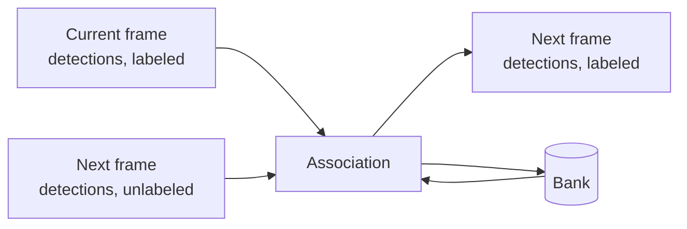

# Spatial-Aware Multi-Person Re-Identification

<!-- Lead with the current output: a sample, then the demo. Write once the project is done. -->

This project builds on a presentation my groupmates, Mark Gallardo and Caine Bautista, and I delivered at the 8th Collaborative Online International Learning (COIL) Conference. Our approach at the time scored each pair of people (one from the current frame, one from the next) in isolation. When following one person, the best-scoring match decided which person in the next frame, if any, was the tracked one; when tracking everyone, the scores went through Hungarian matching[^kuhn]. Attention mixed three inputs per pair: a learnable summary token, the difference between the two people's appearance embeddings, and their element-wise product. The summary token's output was combined with spatial and temporal features (position offsets, overlap, scale, time gap) to produce a match score.

I wanted to improve this by matching everyone at once. Instead of scoring pairs in isolation, the model looks at every person in the current frame and every detection in the new frame together, so one match can inform another, with the spatial features from the previous project guiding it.

Trackers also tend to lose people who stay hidden for more than a moment. In MOT17 alone, 47 of 587 occlusions last longer than two seconds[^stats], well past ByteTrack's default wait of one second[^bytetrack]. When a person loses their detection, whether behind an obstacle or off-screen, they go into a bank that remembers their appearance and last known state. The bank also decides how long each entry is kept before the person is considered gone.

The same bank lets the tracker re-identify people who leave the frame and come back. MOT17 gives returning people new IDs[^mot16], so this can't be scored on it directly. Instead, it is tested by simulating exits.

My approach follows this structure:



Every result below is on the MOT17 validation half, using the same public FRCNN detections for every tracker, unless a table says otherwise.

## Phase 0: Preparing the dataset

This project uses [MOT17](https://motchallenge.net/data/MOT17/)[^mot16]. Before anything else, the data was cleaned:

- **Triplicate sequences.** MOT17 ships every sequence three times, once per public detector (DPM, FRCNN, SDP), with identical images and ground truth. All 14 sequences were verified identical by content hash and collapsed into one copy, with the three detection files side by side. This saves 3.9 GB and rules out a subtle leak: splitting train and validation by detector folder would put the same video on both sides.
- **Unsorted detections.** Some detection files are out of frame order (246 rows in MOT17-02's FRCNN file), so every file is sorted on load.
- **Mixed formats.** DPM detections have ten columns and unbounded scores (−0.5 to 4.77); FRCNN and SDP have seven columns and scores in [0, 1]. They are parsed into one format, and score thresholds are set per detector.
- **Coordinates.** MOT boxes are 1-based `left, top, width, height`. They are converted to 0-based corners internally and back when writing results.
- **Boxes past the frame.** 14.6% of pedestrian boxes extend beyond the image border[^stats], so boxes are clipped before cropping.
- **What gets scored.** Only pedestrians marked for evaluation are used as targets. Static people, people on vehicles and reflections are ignored, following the benchmark's rules[^mot16].
- **Hidden people.** People stay annotated while fully occluded, so their crops show whoever is in front. 18.9% of training crops have visibility below 0.2[^stats], and these are left out when training the appearance model.
- **Split.** Each training sequence is cut in time: the first half for training, the second for validation. This follows CenterTrack's convention[^centertrack], so results stay comparable with published work.

### What the data looks like

Before designing anything, I measured how often people actually disappear. A *gap* is a stretch where someone's visibility drops below 0.1 and later comes back.

| Sequence | FPS | Frames | Size | Camera | People | Boxes | Mostly hidden | Past border | Gaps | > 1 s | > 2 s | Longest |
|---|---|---|---|---|---|---|---|---|---|---|---|---|
| MOT17-02 | 30 | 600 | 1920×1080 | static | 62 | 18,581 | 49.4% | 1.7% | 144 | 55 | 24 | 11.0 s |
| MOT17-04 | 30 | 1050 | 1920×1080 | static | 83 | 47,557 | 16.3% | 26.0% | 43 | 11 | 7 | 8.9 s |
| MOT17-05 | 14 | 837 | 640×480 | moving | 133 | 6,917 | 31.1% | 22.4% | 112 | 12 | 3 | 8.6 s |
| MOT17-09 | 30 | 525 | 1920×1080 | static | 26 | 5,325 | 29.7% | 11.1% | 41 | 12 | 5 | 7.0 s |
| MOT17-10 | 30 | 654 | 1920×1080 | moving | 57 | 12,839 | 17.8% | 3.9% | 110 | 12 | 4 | 2.8 s |
| MOT17-11 | 30 | 900 | 1920×1080 | moving | 75 | 9,436 | 20.3% | 7.2% | 41 | 7 | 4 | 2.8 s |
| MOT17-13 | 25 | 750 | 1920×1080 | moving | 110 | 11,642 | 13.9% | 3.5% | 96 | 1 | 0 | 1.4 s |
| **Total** | | **5,316** | | | **546** | **112,297** | **23.6%** | **14.6%** | **587** | **110** | **47** | **11.0 s** |

"Mostly hidden" is the share of boxes below 25% visibility. Three things shaped the design:
- Almost a quarter of all boxes are mostly hidden.
- The frame rate varies, so every time limit in the tracker is in seconds, not frames.
- Four of the seven cameras move.

When I split each sequence in half, I also found that 152 of the 339 people in the validation half also appear in the training half. So whenever I score the appearance model on its own, I only use the people it has never seen.

<details>
<summary>The split, per sequence</summary>

| Sequence | People (train half) | People (val half) | In both | Training crops | Visibility ≥ 0.3 | Visibility < 0.2 |
|---|---|---|---|---|---|---|
| MOT17-02 | 42 | 53 | 33 | 8,701 | 4,627 (53.2%) | 3,577 (41.1%) |
| MOT17-04 | 62 | 69 | 48 | 23,379 | 18,459 (79.0%) | 2,662 (11.4%) |
| MOT17-05 | 68 | 71 | 6 | 3,560 | 2,212 (62.1%) | 1,150 (32.3%) |
| MOT17-09 | 17 | 22 | 13 | 2,446 | 1,719 (70.3%) | 657 (26.9%) |
| MOT17-10 | 44 | 36 | 23 | 6,916 | 5,371 (77.7%) | 1,269 (18.3%) |
| MOT17-11 | 41 | 44 | 10 | 4,919 | 3,988 (81.1%) | 687 (14.0%) |
| MOT17-13 | 85 | 44 | 19 | 8,486 | 6,892 (81.2%) | 1,053 (12.4%) |
| **Total** | **359** | **339** | **152** | **58,407** | **43,268 (74.1%)** | **11,055 (18.9%)** |

</details>

<details>
<summary>The public detections</summary>

| Detector | Boxes (train) | Lowest score | Highest score |
|---|---|---|---|
| DPM | 79,790 | −0.50 | 4.77 |
| FRCNN | 67,639 | 0.05 | 1.00 |
| SDP | 82,787 | 0.40 | 1.00 |

</details>

### Checking the scorer

Before trusting any number, I checked the evaluation itself. The cleaned ground truth, scored as if it were tracker output, gets a perfect 100 in HOTA[^hota], MOTA[^clear] and IDF1[^idf1] with zero ID switches on every split. To make sure a perfect score isn't free, I also scored detections with no tracking at all, where every box gets a new ID:

| Output | HOTA | DetA | AssA | MOTA | IDF1 | ID switches |
|---|---|---|---|---|---|---|
| Ground truth | 100.0 | 100.0 | 100.0 | 100.0 | 100.0 | 0 |
| FRCNN detections, no tracking | 5.0 | 43.6 | 0.6 | −0.7 | 0.7 | 26,306 |

Detection accuracy stays at 43.6 but association accuracy collapses, so the scorer really measures who is who.

## Phase 1: Baselines

Before building anything new, I needed numbers to beat. I reimplemented three standard trackers from their papers and ran them on the same public FRCNN detections:
- SORT[^sort] only uses motion.
- ByteTrack[^bytetrack] also gives low-confidence detections a second chance.
- DeepSORT[^deepsort] adds an appearance memory using OSNet[^osnet] embeddings trained on MSMT17[^msmt17].

Thresholds were tuned on the training half and results reported on the validation half, so no number here was tuned on the data it was scored on.

| Tracker | HOTA | AssA | IDF1 | ID switches | Matching time |
|---|---|---|---|---|---|
| SORT | 48.4 | 56.2 | 54.5 | 222 | 0.53 ms/frame |
| ByteTrack | 49.4 | 57.7 | 56.2 | 198 | 0.79 ms/frame |
| DeepSORT + OSNet | **51.3** | **62.6** | **59.9** | **121** | 1.83 ms/frame |

<details>
<summary>Tuning on the training half</summary>

SORT and ByteTrack barely care about the detection threshold, so ByteTrack keeps its published default (0.6). DeepSORT is sensitive to how different two looks may be before it refuses a match (the cosine limit): loosening it from 0.2 to 0.4 costs about 3 HOTA.

| Tracker | Setting | HOTA | DetA | AssA | MOTA | IDF1 | ID switches |
|---|---|---|---|---|---|---|---|
| SORT | min score 0.3 | 49.8 | 45.4 | 54.9 | 50.0 | 55.5 | 346 |
| SORT | min score 0.5 | 49.9 | 45.1 | 55.4 | 49.9 | 55.8 | 317 |
| SORT | min score 0.7 | 49.8 | 44.9 | 55.6 | 49.7 | 55.7 | 292 |
| SORT | min score 0.9 | 49.6 | 44.3 | 55.8 | 49.1 | 55.3 | 224 |
| ByteTrack | track threshold 0.4 | 52.2 | 46.2 | 59.2 | 51.3 | 59.6 | 345 |
| ByteTrack | track threshold 0.5 | 52.0 | 46.1 | 59.1 | 51.3 | 59.5 | 323 |
| ByteTrack | track threshold 0.6 | 52.1 | 46.1 | 59.3 | 51.4 | 59.6 | 308 |
| ByteTrack | track threshold 0.7 | 52.0 | 45.9 | 59.1 | 51.4 | 59.6 | 285 |
| ByteTrack | track threshold 0.8 | 51.9 | 45.5 | 59.5 | 51.3 | 59.3 | 239 |
| DeepSORT | min score 0.3, cosine 0.2 | 53.3 | 46.1 | 61.9 | 51.1 | 62.1 | 231 |
| DeepSORT | min score 0.3, cosine 0.3 | 52.8 | 46.1 | 60.8 | 51.1 | 61.2 | 243 |
| DeepSORT | min score 0.3, cosine 0.4 | 50.7 | 46.1 | 56.2 | 50.9 | 56.8 | 312 |
| DeepSORT | min score 0.5, cosine 0.2 | 53.3 | 45.9 | 62.2 | 51.1 | 62.2 | 199 |
| DeepSORT | min score 0.5, cosine 0.3 | 52.9 | 46.0 | 61.0 | 51.4 | 61.3 | 205 |
| DeepSORT | min score 0.5, cosine 0.4 | 50.4 | 46.0 | 55.6 | 51.1 | 56.6 | 283 |
| DeepSORT | min score 0.7, cosine 0.2 | 53.0 | 45.6 | 61.9 | 51.0 | 61.9 | 177 |
| DeepSORT | min score 0.7, cosine 0.3 | 52.8 | 45.8 | 61.2 | 51.3 | 61.1 | 161 |
| DeepSORT | min score 0.7, cosine 0.4 | 50.0 | 45.7 | 55.0 | 51.2 | 55.8 | 241 |

</details>

A few things stood out:

- **Remembering people pays off most where they get hidden.** ByteTrack's biggest gain was on MOT17-02, the most occluded sequence, where association accuracy went up by 10.5 points.
- **Motion alone falls apart when the camera moves.** Both motion-only trackers struggled on MOT17-10, filmed from a moving camera at night.
- **Appearance helps a lot.** DeepSORT cut ID switches by 39% compared to ByteTrack and gained 9.4 HOTA on MOT17-11, another moving-camera sequence. DeepSORT's memory is the simplest version of what I'm building: it looks up the closest-looking person and stores everything. That makes it the bar my approach has to clear.

### Where the time goes

Since this is meant to run in real time (30 FPS, or 33 ms per frame), I also measured where the time goes on my laptop's RTX 4050.

- **Decoding the frame.** A 1080p frame takes 9.8 ms to decode on the CPU, about a third of the budget. Decoding it on the GPU with nvjpeg takes 4.0 ms and leaves the frame on the GPU, ready for the next step.
- **Matching is cheap.** Every tracker above takes under 2 ms per frame.
- **The appearance model is the expensive part.** OSNet takes about 14 ms even for a single crop, because most of that time goes into launching its many small layers rather than computing. Recording the model as a CUDA graph and replaying it cut 8 crops from 15.7 ms to 5.2 ms, with identical outputs. Past 32 crops, OSNet's depthwise convolutions become the bottleneck, so a low FLOP count doesn't guarantee low latency on a GPU. I'll pick the appearance model by measured time, not by FLOPs.

| Decoder (MOT17-04, 1920×1080) | Read | Decode | Upload to GPU | Total | FPS |
|---|---|---|---|---|---|
| OpenCV, full resolution | 0.31 ms | 7.95 ms | 1.49 ms | 9.78 ms | 102 |
| OpenCV, half resolution | 0.23 ms | 3.85 ms | 0.42 ms | 4.52 ms | 221 |
| nvjpeg on the GPU | 0.24 ms | 3.73 ms | – | 3.98 ms | 251 |

## Phase 2: Fine-tuning the appearance model

The OSNet in DeepSORT was trained on MSMT17, which is a different set of cameras and people from MOT17. So the next step was to teach an appearance model what "the same person" looks like in these videos.

### Cutting the crops

I cut a crop of every visible pedestrian in the training half, using the exact same GPU cropping the tracker uses, so training and tracking see identical pixels. Looking through the crops showed a problem the visibility filter doesn't catch. Some crops were just legs, from people mostly outside the frame. MOT17's visibility field counts occlusion by other people but ignores the image border.

| Sequence | Crops (visibility ≥ 0.3) | Less than 60% inside the frame | Less than 90% inside |
|---|---|---|---|
| MOT17-02 | 4,627 | 9 (0.2%) | 19 (0.4%) |
| MOT17-04 | 18,459 | 987 (5.3%) | 2,537 (13.7%) |
| MOT17-05 | 2,212 | 79 (3.6%) | 583 (26.4%) |
| MOT17-09 | 1,719 | 61 (3.5%) | 175 (10.2%) |
| MOT17-10 | 5,371 | 53 (1.0%) | 195 (3.6%) |
| MOT17-11 | 3,988 | 51 (1.3%) | 166 (4.2%) |
| MOT17-13 | 6,892 | 50 (0.7%) | 115 (1.7%) |
| **Total** | **43,268** | **1,290 (3.0%)** | **3,790 (8.8%)** |

After dropping anyone less than 60% inside the frame, I had 41,978 training crops of 325 people. For scoring, I cut 11,555 crops of 305 people from every third frame of the validation half.

### Choosing a model by speed first

Since the appearance model is the expensive part, I timed every candidate before training any of them. The weights don't affect speed, so random ones were enough.

| Model | Parameters | GMACs per crop | 8 crops | 8, graphed | 16 crops | 16, graphed | 32 crops | 32, graphed |
|---|---|---|---|---|---|---|---|---|
| OSNet x1.0 | 2.2 M | 0.98 | 14.8 ms | 5.2 ms | 12.2 ms | 9.1 ms | 20.4 ms | 18.8 ms |
| OSNet x0.5 | 0.6 M | 0.27 | 13.4 ms | 2.8 ms | 12.7 ms | 4.2 ms | 13.6 ms | 9.1 ms |
| OSNet x0.25 | 0.2 M | 0.08 | 13.3 ms | 2.8 ms | 17.7 ms | 2.6 ms | 14.2 ms | 5.2 ms |
| ResNet18 | 11.2 M | 1.99 | 2.9 ms | 2.8 ms | 5.2 ms | 5.1 ms | 10.3 ms | 9.4 ms |
| ResNet34 | 21.3 M | 3.65 | 4.8 ms | 4.7 ms | 8.5 ms | 8.1 ms | 15.4 ms | 15.1 ms |

(fp16, 256×128 crops, channels-last memory layout, RTX 4050 Laptop.)

The most surprising result: ResNet18[^resnet] does twice as much arithmetic per crop as OSNet x1.0 but runs three to five times faster, because the GPU is built for its dense convolutions. The smaller OSNets only become fast once they're replayed as CUDA graphs. I kept OSNet x1.0 as the accuracy reference and ResNet18 and OSNet x0.5 as the speed candidates.

I also hit a trap while setting up training. The channels-last memory layout, which usually speeds up half-precision work, made training steps over six times slower on this GPU, while making inference slightly faster. So training uses the default layout and inference uses channels-last.

| Model (batch of 64) | Default layout, fp16 | Default layout, fp32 | Channels-last, fp16 | Channels-last, fp32 |
|---|---|---|---|---|
| OSNet x1.0 | 181 ms | 336 ms | 1,151 ms | 1,532 ms |
| OSNet x0.5 | 82 ms | 155 ms | 497 ms | 636 ms |
| ResNet18 | 85 ms | 159 ms | 257 ms | 355 ms |

### Training

Training follows the standard recipe from *Bag of Tricks*[^bagoftricks]: an identity classifier with label smoothing plus a triplet loss[^triplet] that pulls each person's least similar crop closer than their most similar stranger. I changed two things for tracking:

- **Every batch comes from one video.** Sixteen people from the same sequence share its lighting and background, which are exactly the look-alikes the tracker has to tell apart.
- **Each person's four crops come from four different stretches of their track.** Matching across time is harder than matching neighbouring frames, and it's what the bank needs.

The augmentations cover the camera problems I wanted the model to shrug off: brightness, contrast, saturation and warmth changes, a lighting change across part of the crop, random erasing[^erasing] for partial blocking, plus flips and small shifts.

I score the model on how well it finds each unseen validation person among everyone else in the same video (mAP and Rank-1). Crops of the same person within a second of the query don't count, so near-identical neighbouring frames can't inflate the score. Training can be paused and resumed at any point.

| OSNet x1.0 | mAP | Rank-1 |
|---|---|---|
| Off the shelf (MSMT17) | 71.2 | 80.8 |
| After 5 epochs | 74.5 | 85.1 |
| After 10 epochs | 74.8 | 86.7 |
| After 15 epochs | 76.5 | 88.1 |
| After 20 epochs | 77.3 | 87.3 |
| After 25 epochs | 78.1 | 88.3 |
| After 30 epochs (final) | 77.9 | 88.1 |

Fine-tuning on MOT17 added 6.7 mAP and 7.3 points of Rank-1 on people the model never saw. The score levelled off over the last five epochs as the learning rate wound down. The tracker uses the final model, not the best-scoring checkpoint, because picking by validation score would leak the validation half into the choice.

*ResNet18 and OSNet x0.5 are training next, and the fine-tuned model's effect on tracking comes after.*

## Phase 3: My tracker

This is where the bank comes in. Every person the tracker knows about is an entry in the bank, with:
- a motion estimate (a Kalman filter);
- a running average of their appearance, plus a few distinct views of them;
- a state: *active* (seen last frame), *occluded* (lost somewhere inside the frame), *exited* (last seen at the edge, walking out), or *tentative* (new and unconfirmed).

Each frame, the tracker:
1. **Retrieves** likely candidates from the bank for every detection.
2. **Scores** the pairs.
3. **Matches** everyone in one assignment, and can decide a detection is a new person.
4. **Writes** back only clean sightings: confident, and not overlapped by someone else.
5. **Forgets** entries that have been gone too long for their state.

### First version: hand-set rules

I started with matching rules I set by hand, so everything around them could be tested first. The first attempt only trusted appearance when a detection overlapped the person's predicted box, the rule BoT-SORT[^botsort] uses. It did well on some videos and badly on moving-camera ones. BoT-SORT gets away with it because it compensates for camera motion first. Letting appearance count anywhere the motion model says is plausible fixed most of that.

| Version (training half) | HOTA | DetA | AssA | MOTA | IDF1 | ID switches |
|---|---|---|---|---|---|---|
| Appearance only near the prediction | 52.5 | 46.2 | 60.1 | 51.6 | 59.7 | 263 |
| Appearance within the motion gate, limit 0.10 | 52.8 | 46.2 | 60.7 | 51.6 | 60.2 | 252 |
| Appearance within the motion gate, limit 0.15 | 52.9 | 46.2 | 60.9 | 51.6 | 60.4 | 250 |
| Appearance within the motion gate, limit 0.20 | 52.8 | 46.2 | 60.6 | 51.6 | 60.2 | 233 |
| Limit 0.15, lower score thresholds | 52.8 | 46.3 | 60.6 | 51.6 | 60.2 | 277 |

Then I tested the bank's design choices one at a time:

| Bank variant (training half) | HOTA | DetA | AssA | MOTA | IDF1 | ID switches |
|---|---|---|---|---|---|---|
| Write gate, 4 stored views | 52.9 | 46.2 | 60.9 | 51.6 | 60.4 | 250 |
| No write gate (store every match) | 52.9 | 46.2 | 60.9 | 51.6 | 60.6 | 250 |
| 16 stored views | 52.5 | 46.2 | 60.0 | 51.6 | 59.7 | 242 |
| 16 stored views, no write gate | 52.7 | 46.2 | 60.3 | 51.6 | 60.0 | 237 |
| Keep hidden people for 3 s | 52.9 | 46.2 | 61.0 | 51.7 | 60.5 | 254 |
| Keep hidden people for 5 s | 53.0 | 46.3 | 61.0 | 51.7 | 60.4 | 250 |
| Looser recall limit (0.25) | 51.8 | 46.2 | 58.5 | 51.6 | 58.3 | 250 |

- **A few distinct views beat many.** Every extra stored view is another chance to match the wrong person, so 4 views beat 16.
- **A looser recall limit brings back the wrong people.**
- **The write gate made no difference with these features.** I'm keeping it, but it hasn't earned its place yet.

### Compensating for camera motion

Four of the cameras move, so I estimated how each frame shifts relative to the last and moved every bank entry with it, as BoT-SORT[^botsort] does.

| Sequence | Camera | Average shift per frame | Largest shift | Estimation time |
|---|---|---|---|---|
| MOT17-02 | static | 0.21 px | 0.8 px | 23.8 ms |
| MOT17-04 | static | 0.19 px | 0.6 px | 24.3 ms |
| MOT17-05 | moving | 5.37 px | 42.8 px | 5.8 ms |
| MOT17-09 | static | 0.40 px | 4.5 px | 23.6 ms |
| MOT17-10 | moving | 4.95 px | 31.6 px | 24.9 ms |
| MOT17-11 | moving | 4.82 px | 17.2 px | 24.7 ms |
| MOT17-13 | moving | 12.81 px | 53.0 px | 24.3 ms |

| Camera compensation (training half) | HOTA | DetA | AssA | MOTA | IDF1 | ID switches | MOT17-05 | MOT17-10 | MOT17-11 | MOT17-13 |
|---|---|---|---|---|---|---|---|---|---|---|
| Off | 53.0 | 46.3 | 61.0 | 51.7 | 60.4 | 250 | 40.1 | 45.6 | 59.9 | 45.9 |
| On | 52.9 | 46.4 | 60.6 | 51.8 | 60.4 | 200 | 40.2 | 46.5 | 59.2 | 45.1 |

(The last four columns are HOTA on the moving-camera sequences.)

The result was mixed. ID switches dropped by 20%, but HOTA didn't move. MOT17-13 is filmed from a vehicle, and its perspective changes more than a simple shift, rotation and zoom can describe. Compensation stays available, but off by default.

### Learning the matching

The hand-set rules levelled off at about DeepSORT's level. So instead of tuning them further, I let a small network learn how to weigh the evidence. For every candidate pair of bank entry and detection, it sees:
- how similar they look (best view and running average);
- the spatial features from the original project, measured against where the person should be now (overlap, offsets, scale, corner offsets);
- how plausible the position is to the motion model;
- how long the person has been gone, their state, the detection's confidence, and how crowded the detection is.

To train it, I ran the hand-set tracker over the training half and recorded every pair it considered: 850,028 pairs, 30,001 of them the same person. That way the network learns from the situations the tracker actually gets into, including its own mistakes[^learningtotrack]. On two sequences held out from its training, it recognises same-person pairs with 97.5 average precision (87.9% precision, 99.8% recall).

<details>
<summary>Choosing the acceptance threshold (training half)</summary>

The tracker accepts a match only when the network is confident enough, and otherwise treats the detection as a new person.

| Accept above | HOTA | DetA | AssA | MOTA | IDF1 | ID switches |
|---|---|---|---|---|---|---|
| 0.3 | 54.3 | 46.3 | 63.8 | 51.7 | 63.8 | 185 |
| 0.5 | 54.6 | 46.4 | 64.6 | 51.8 | 64.3 | 169 |
| 0.7 | 54.1 | 46.4 | 63.4 | 51.7 | 63.5 | 186 |
| 0.9 | 53.0 | 46.2 | 61.1 | 51.5 | 61.7 | 236 |

These are optimistic, since the network was trained on this half. The validation half below is the honest test.

</details>

On the validation half, with identical detections and identical OSNet features, the learned matching beats every baseline:

| Tracker | HOTA | AssA | IDF1 | ID switches | Matching time |
|---|---|---|---|---|---|
| SORT | 48.4 | 56.2 | 54.5 | 222 | 0.53 ms/frame |
| ByteTrack | 49.4 | 57.7 | 56.2 | 198 | 0.79 ms/frame |
| Mine, hand-set rules | 50.2 | 59.2 | 56.1 | 142 | 3.0 ms/frame |
| DeepSORT | 51.3 | 62.6 | 59.9 | 121 | 1.83 ms/frame |
| **Mine, learned matching** | **52.0 ± 0.3** | **63.5 ± 0.6** | **60.6 ± 0.4** | 105–124 | 4.0 ms/frame |

The learned row is the mean ± standard deviation over three training runs:

| Training run | HOTA | DetA | AssA | MOTA | IDF1 | ID switches |
|---|---|---|---|---|---|---|
| 1 | 52.3 | 42.8 | 64.2 | 47.8 | 61.2 | 110 |
| 2 | 52.0 | 42.8 | 63.4 | 47.7 | 60.6 | 124 |
| 3 | 51.7 | 42.8 | 62.8 | 47.8 | 60.1 | 105 |

<details>
<summary>HOTA per sequence</summary>

| Tracker | MOT17-02 | MOT17-04 | MOT17-05 | MOT17-09 | MOT17-10 | MOT17-11 | MOT17-13 | Combined |
|---|---|---|---|---|---|---|---|---|
| SORT | 29.5 | 54.2 | 43.6 | 48.9 | 49.8 | 47.9 | 50.3 | 48.4 |
| ByteTrack | 34.4 | 54.6 | 44.1 | 50.9 | 48.9 | 48.6 | 53.0 | 49.4 |
| Mine, hand-set rules | 35.8 | 54.9 | 43.4 | 50.6 | 51.1 | 50.4 | 54.1 | 50.2 |
| DeepSORT | 36.3 | 55.6 | 46.8 | 51.6 | 50.6 | 58.0 | 52.0 | 51.3 |
| Mine, learned (run 1) | 37.7 | 56.0 | 46.0 | 53.2 | 53.6 | 58.4 | 55.4 | 52.3 |

</details>

It wins on six of the seven videos, most on MOT17-10 and MOT17-13, the two moving-camera ones at night and from a vehicle. The edge over DeepSORT is real but modest, about two standard deviations. I'm not calling it a clear win until the fine-tuned appearance model and the next steps are in. Matching takes 4.0 ms per frame; batching the motion checks across all entries brought that down from 5.7 ms without changing a single result.

### Next

- Re-run everything with the fine-tuned appearance models, and pick one by accuracy per millisecond.
- Let each detection's score see its competitors (the context model), so one match can inform another.
- Learn when to forget someone instead of using a fixed time.
- Test re-entry with simulated exits, and report predicted boxes for hidden people.

## Usage

Requires [uv](https://docs.astral.sh/uv/). On Windows and Linux, `uv sync` installs PyTorch built for CUDA 13.0.

```bash
uv sync
```

### Data

Extract the MOT17 release so that `MOT17/train` and `MOT17/test` sit at the repository root, then:

```bash
uv run python -m reidtrack.data.prepare --raw MOT17 --out data/mot17
uv run python -m reidtrack.data.stats --root data/mot17
```

`prepare` verifies and deduplicates the release into `data/mot17` and exports the splits for evaluation. It writes nothing if the copies differ. Afterwards `MOT17/` can be deleted. `stats` prints the per-sequence figures quoted above. MOT17 is not part of this repository and remains under its own terms.

### Appearance model

```bash
uv run python -m reidtrack.retrieval.cache --weights data/weights/osnet_x1_0_msmt17.pth
uv run python -m reidtrack.retrieval.crops --split train_half
uv run python -m reidtrack.retrieval.crops --split val_half --stride 3
uv run python -m reidtrack.retrieval.bench
uv run python -m reidtrack.retrieval.train --backbone osnet_x1_0 --init data/weights/osnet_x1_0_msmt17.pth
```

- **`cache`** embeds every public detection with OSNet[^osnet] and stores the vectors under `data/mot17/cache/`. The MSMT17-trained weights come from the torchreid model zoo[^torchreid].
- **`crops`** cuts the training and scoring crops.
- **`bench`** times candidate models.
- **`train`** fine-tunes one. Press Ctrl+C, or create a file named `PAUSE` in its run folder, to pause; run the same command with `--resume` to continue.

### Tracking

```bash
uv run python -m reidtrack.baselines sort --min-score 0.5
uv run python -m reidtrack.baselines bytetrack
uv run python -m reidtrack.baselines deepsort --min-score 0.5 --max-cosine 0.2
uv run python -m reidtrack.track.camera
uv run python -m reidtrack.association.train --embeddings osnet_x1_0_msmt17
uv run python -m reidtrack --reranker data/weights/reranker/pairwise_osnet_x1_0_msmt17.pt
```

- **`baselines`** runs my reimplementations of SORT[^sort], ByteTrack[^bytetrack] and DeepSORT[^deepsort].
- **`track.camera`** caches camera motion.
- **`association.train`** records candidate pairs and trains the learned matching.
- **`python -m reidtrack`** runs my tracker. Add `--camera` for camera compensation, and `--set key=value` to change any setting.

Results and scores go to `runs/<name>/`.

### Evaluation

```bash
uv run python -m reidtrack.eval --results runs/<tracker> --split val_half
uv run python -m reidtrack.eval --oracle
```

Result files are one `<sequence>.txt` per sequence in MOT format, using the sequence's own frame numbers; rows outside the split are ignored. Scoring uses TrackEval[^hota]. `--oracle` scores the ground truth itself and must report 100.

### Visualisation

```bash
uv run python -m reidtrack.viz MOT17-02 --gt --split val_half --scale 0.5
uv run python -m reidtrack.viz MOT17-02 --results runs/<tracker>/MOT17-02.txt --frame 340
```

Writes an MP4, or a PNG for a single `--frame`, to `runs/viz/`. People who are annotated but hidden are drawn dashed.

### Latency

```bash
uv run python -m reidtrack.eval.latency --seq MOT17-04
```

Benchmarks reading and decoding frames. `StageTimer` in `reidtrack.eval.latency` times the stages of a pipeline.

### Tests

```bash
uv run pytest
```

## License

Apache-2.0; see [LICENSE](LICENSE). `src/reidtrack/retrieval/osnet.py` is adapted from deep-person-reid[^torchreid] under the MIT License, whose notice is kept in that file. Pretrained weights and datasets are not included and remain under their own terms.

[^kuhn]: H. W. Kuhn. The Hungarian method for the assignment problem. *Naval Research Logistics Quarterly*, 2(1–2):83–97, 1955.
[^stats]: Measured on the MOT17 training set with `python -m reidtrack.data.stats`. An occlusion here is a stretch in which a person's visibility drops below 0.1 and later recovers.
[^bytetrack]: Y. Zhang et al. ByteTrack: Multi-Object Tracking by Associating Every Detection Box. *ECCV*, 2022. [arXiv:2110.06864](https://arxiv.org/abs/2110.06864). The reference implementation keeps a lost track for 30 frames (`track_buffer`), scaled to the frame rate.
[^mot16]: A. Milan, L. Leal-Taixé, I. Reid, S. Roth, K. Schindler. MOT16: A Benchmark for Multi-Object Tracking. [arXiv:1603.00831](https://arxiv.org/abs/1603.00831), 2016. Annotation rules in §2; evaluation classes in §4.
[^centertrack]: X. Zhou, V. Koltun, P. Krähenbühl. Tracking Objects as Points. *ECCV*, 2020. [arXiv:2004.01177](https://arxiv.org/abs/2004.01177).
[^hota]: J. Luiten et al. HOTA: A Higher Order Metric for Evaluating Multi-Object Tracking. *IJCV*, 2021. [arXiv:2009.07736](https://arxiv.org/abs/2009.07736). Computed with [TrackEval](https://github.com/JonathonLuiten/TrackEval).
[^clear]: K. Bernardin, R. Stiefelhagen. Evaluating Multiple Object Tracking Performance: The CLEAR MOT Metrics. *EURASIP Journal on Image and Video Processing*, 2008.
[^idf1]: E. Ristani, F. Solera, R. Zou, R. Cucchiara, C. Tomasi. Performance Measures and a Data Set for Multi-Target, Multi-Camera Tracking. *ECCV Workshops*, 2016. [arXiv:1609.01775](https://arxiv.org/abs/1609.01775).
[^sort]: A. Bewley, Z. Ge, L. Ott, F. Ramos, B. Upcroft. Simple Online and Realtime Tracking. *ICIP*, 2016. [arXiv:1602.00763](https://arxiv.org/abs/1602.00763).
[^deepsort]: N. Wojke, A. Bewley, D. Paulus. Simple Online and Realtime Tracking with a Deep Association Metric. *ICIP*, 2017. [arXiv:1703.07402](https://arxiv.org/abs/1703.07402).
[^osnet]: K. Zhou, Y. Yang, A. Cavallaro, T. Xiang. Omni-Scale Feature Learning for Person Re-Identification. *ICCV*, 2019. [arXiv:1905.00953](https://arxiv.org/abs/1905.00953).
[^torchreid]: K. Zhou, T. Xiang. Torchreid: A Library for Deep Learning Person Re-Identification in Pytorch. [arXiv:1910.10093](https://arxiv.org/abs/1910.10093), 2019. Code and model zoo: [deep-person-reid](https://github.com/KaiyangZhou/deep-person-reid).
[^msmt17]: L. Wei, S. Zhang, W. Gao, Q. Tian. Person Transfer GAN to Bridge Domain Gap for Person Re-Identification. *CVPR*, 2018. [arXiv:1711.08565](https://arxiv.org/abs/1711.08565).
[^resnet]: K. He, X. Zhang, S. Ren, J. Sun. Deep Residual Learning for Image Recognition. *CVPR*, 2016. [arXiv:1512.03385](https://arxiv.org/abs/1512.03385).
[^bagoftricks]: H. Luo, Y. Gu, X. Liao, S. Lai, W. Jiang. Bag of Tricks and A Strong Baseline for Deep Person Re-identification. *CVPR Workshops*, 2019. [arXiv:1903.07071](https://arxiv.org/abs/1903.07071).
[^triplet]: A. Hermans, L. Beyer, B. Leibe. In Defense of the Triplet Loss for Person Re-Identification. [arXiv:1703.07737](https://arxiv.org/abs/1703.07737), 2017.
[^erasing]: Z. Zhong, L. Zheng, G. Kang, S. Li, Y. Yang. Random Erasing Data Augmentation. *AAAI*, 2020. [arXiv:1708.04896](https://arxiv.org/abs/1708.04896).
[^botsort]: N. Aharon, R. Orfaig, B.-Z. Bobrovsky. BoT-SORT: Robust Associations Multi-Pedestrian Tracking. [arXiv:2206.14651](https://arxiv.org/abs/2206.14651), 2022.
[^learningtotrack]: Y. Xiang, A. Alahi, S. Savarese. Learning to Track: Online Multi-Object Tracking by Decision Making. *ICCV*, 2015.
